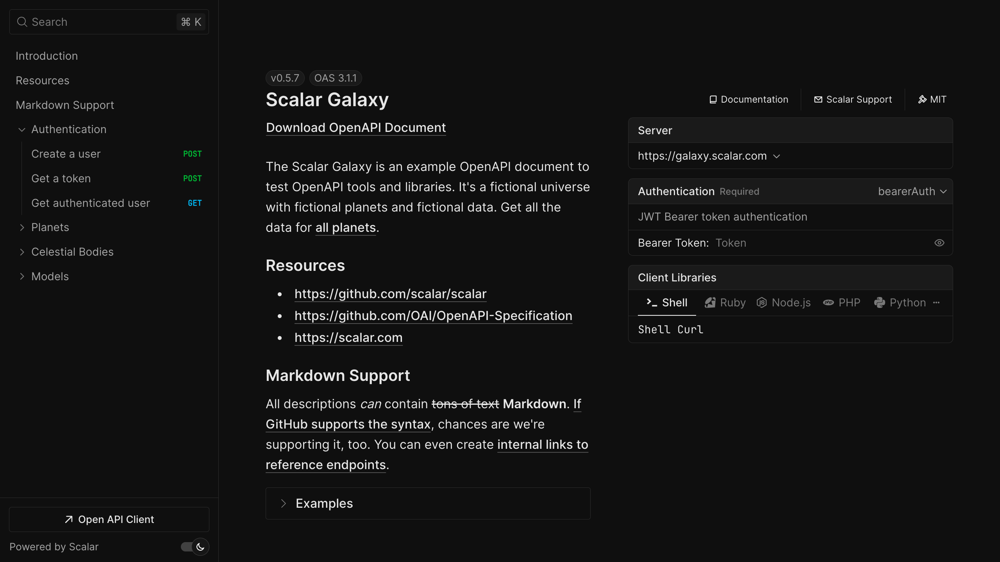

# Express API documentation

Replace `swagger-ui-express` with an interactive Scalar API reference by changing one middleware in your Express app.

When people search for "Express Swagger", they usually want two things: an OpenAPI document that describes their routes, and a page that renders it. Express does not produce the document itself, so most teams write it with JSDoc comments and [`swagger-jsdoc`](https://github.com/Surnet/swagger-jsdoc), or generate it from Zod schemas with `express-zod-api`. `@scalar/express-api-reference` takes care of the second part: it renders that document with a built-in request client, search, themes and code samples.

## Set up Scalar in Express

<scalar-steps>
  <scalar-step id="install" title="Install the middleware">

```bash
npm install @scalar/express-api-reference
```

If you do not have an OpenAPI document yet, add `swagger-jsdoc` too: `npm install swagger-jsdoc`.

  </scalar-step>

  <scalar-step id="configure" title="Serve the document and mount apiReference">

This is the pattern from the Express playground in the Scalar repository. JSDoc `@openapi` comments on your routes become the document, which is served as JSON and rendered by Scalar:

```typescript
import Express from 'express'
import swaggerJsdoc from 'swagger-jsdoc'
import { apiReference } from '@scalar/express-api-reference'

const app = Express()

/**
 * @openapi
 * /status:
 *   get:
 *     description: Get the server status.
 *     responses:
 *       200:
 *         description: Returns the server status.
 */
app.get('/status', (_req, res) => {
  res.json({ status: 'Server is running smoothly!', uptime: process.uptime() })
})

const ApiDefinition = swaggerJsdoc({
  failOnErrors: true,
  definition: {
    openapi: '3.1.0',
    info: { title: 'Express Example', version: '1.0.0' },
  },
  apis: ['./src/**/*.ts'],
})

// Serve the OpenAPI document
app.get('/openapi.json', (_req, res) => {
  res.json(ApiDefinition)
})

// Serve the Scalar API reference
app.use(
  '/reference',
  apiReference({
    url: '/openapi.json',
  }),
)

app.listen(3000)
```

  </scalar-step>

  <scalar-step id="open" title="Start the server and open /reference">

Run your app and open `http://localhost:3000/reference`.

  </scalar-step>
</scalar-steps>



## Try a live reference

The Scalar Galaxy example API below is rendered by the same API reference component the Express middleware serves. Open an operation and send a request from the built-in client.

<iframe src="https://galaxy.scalar.com" title="Scalar Galaxy example API reference" loading="lazy" width="100%" height="600"></iframe>

[Open the live demo in a new tab](https://galaxy.scalar.com)

## Using express-zod-api

If you build your API with `express-zod-api`, the document comes from your Zod schemas. Hook Scalar in through `beforeRouting` and pass the generated document as `content`:

```typescript
import { createConfig } from 'express-zod-api'
import { apiReference } from '@scalar/express-api-reference'

const config = createConfig({
  beforeRouting: ({ app, getLogger }) => {
    const logger = getLogger()
    logger.info('Serving the API reference at https://example.com/docs')

    app.use(
      '/docs',
      apiReference({
        // Pass your generated OpenAPI document
        content: documentation.getSpecAsJson(),
      }),
    )
  },
})
```

The middleware ships with an Express theme by default. Set `theme` to `purple`, `moon`, `solarized` or another built-in theme, or `none` for a blank slate. The [Express integration guide](/products/api-references/integrations/express) covers theming, a custom CDN and the full configuration object.

## What you get

The middleware and the reference are MIT licensed. The OpenAPI document your Express app serves is also the input for the rest of Scalar.

- **An interactive [API reference](/products/api-references).** Every documented route, with search, themes, dark mode and request code samples in popular languages.
- **A built-in [API client](/products/api-client).** "Test Request" opens a full client with environments, authentication and history, a step up from Swagger UI's "Try it out". It also runs as a desktop and web app.
- **[SDKs](/products/sdk-generator)** from the same document. TypeScript, Python, Go and CLI are generally available; Java, Kotlin, Ruby, C#, PHP, Rust, Swift, Dart and C++ are experimental.
- **A [hosted MCP server](/products/agent/mcp)** so AI agents can call the endpoints you choose, with OAuth. Scalar hosts it; there is nothing to deploy next to your Express server.

For SDKs and MCP, write `ApiDefinition` to a file in a build script and publish it to the [Scalar Registry](/products/registry) from CI:

```bash
npx @scalar/cli registry publish --namespace your-namespace --slug your-api ./openapi.json
```

Free hosted docs cover up to 3 APIs; Pro is $150 per month. See [pricing](/pricing).

## Migrating from swagger-ui-express

[`swagger-ui-express`](https://www.npmjs.com/package/swagger-ui-express) is usually mounted as `app.use('/api-docs', swaggerUi.serve, swaggerUi.setup(swaggerDocument))`. Scalar needs the same document and one middleware:

```typescript
// Before
import swaggerUi from 'swagger-ui-express'
app.use('/api-docs', swaggerUi.serve, swaggerUi.setup(swaggerDocument))

// After
import { apiReference } from '@scalar/express-api-reference'
app.use('/api-docs', apiReference({ content: swaggerDocument }))
```

Keep the `/api-docs` path so existing links still work, then remove `swagger-ui-express` from your dependencies. Your `swagger-jsdoc` comments, or the YAML file you load, stay the same. If you had customised Swagger UI with `customCss`, move those rules to Scalar's `customCss` option or pick a built-in theme.

Swagger 2.0 documents render too; Scalar upgrades them on load, so an older `swagger: '2.0'` definition works while you plan a move to OpenAPI 3.1. Coming from Redoc? The same swap applies, and readers get a request client in the page. The [Swagger UI migration guide](/resources/migration/swagger-ui) has a feature-by-feature comparison.

## Frequently asked questions

<scalar-detail title="How do I add Swagger documentation to an Express API?">

Describe your routes in an OpenAPI document, usually with `swagger-jsdoc` comments, serve it as JSON, and mount a UI. With Scalar that UI is `app.use('/reference', apiReference({ url: '/openapi.json' }))` from `@scalar/express-api-reference`.

</scalar-detail>

<scalar-detail title="Is Scalar a drop-in replacement for swagger-ui-express?">

For the rendering part, yes. Both take an OpenAPI document; replace `swaggerUi.serve, swaggerUi.setup(doc)` with `apiReference({ content: doc })` on the same path. Nothing about how you generate the document changes.

</scalar-detail>

<scalar-detail title="Does it work with Express 5?">

Yes. The integration is developed and tested against Express 5. `apiReference` is a plain request handler that returns an HTML page, so Express 4 apps mount it the same way.

</scalar-detail>

<scalar-detail title="Is the Express integration free?">

Yes. `@scalar/express-api-reference` and the API reference are open source under the MIT license. Paid plans cover hosted docs with more APIs and seats, SDKs, and MCP usage.

</scalar-detail>

<scalar-detail title="Can I pass the document directly instead of a URL?">

Yes. Use `content` with a JavaScript object or a JSON or YAML string instead of `url`. Serving the document at a URL is still useful because readers and tools can download it.

</scalar-detail>

## Related

- **Learn:** [OpenAPI vs Swagger](/learn/openapi/openapi-vs-swagger) · [API documentation best practices](/learn/openapi/api-documentation-best-practices)
- **Docs:** [Express integration guide](/products/api-references/integrations/express)
- **Product:** [API References](/products/api-references) — the open-source reference behind the Express middleware, also available hosted
