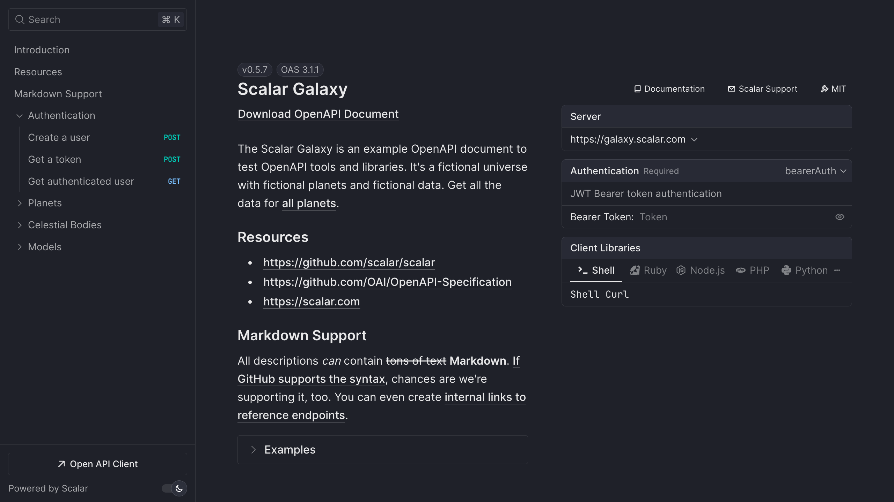

# FastAPI API documentation

Swap FastAPI's built-in docs pages for an interactive Scalar API reference with one `pip install` and one function call.

FastAPI already does the hard part. It builds an OpenAPI document from your path operations, Pydantic models and type hints, and serves it at `/openapi.json`. Out of the box it renders that document twice: [Swagger UI at `/docs` and ReDoc at `/redoc`](https://fastapi.tiangolo.com/tutorial/metadata/#docs-urls). The `scalar-fastapi` package reads the same document and gives you a reference with a built-in request client, search, themes and code samples, without touching your routes.

## Set up Scalar in FastAPI

<scalar-steps>
  <scalar-step id="install" title="Install scalar-fastapi">

```bash
pip install scalar-fastapi
```

  </scalar-step>

  <scalar-step id="configure" title="Add the reference to your app">

`add_scalar_reference` registers the route for you and reads the title and OpenAPI URL from your app:

```python
from fastapi import FastAPI
from scalar_fastapi import add_scalar_reference

app = FastAPI()

add_scalar_reference(app)
```

It accepts `route` (default `/scalar`) and `include_in_schema` (default `False`). Every other keyword argument goes straight to `get_scalar_api_reference`, so you can set a theme in the same call:

```python
from scalar_fastapi import add_scalar_reference, Theme

add_scalar_reference(app, route="/docs/scalar", theme=Theme.KEPLER)
```

  </scalar-step>

  <scalar-step id="open" title="Run the app and open /scalar">

Start the server (for example `fastapi dev main.py` or `uvicorn main:app --reload`) and open `http://127.0.0.1:8000/scalar`.

  </scalar-step>
</scalar-steps>



## Try a live reference

The Scalar Galaxy example API below is rendered by the same API reference component that `scalar-fastapi` serves. Pick an operation and send a request from the built-in client.

<iframe src="https://galaxy.scalar.com" title="Scalar Galaxy example API reference" loading="lazy" width="100%" height="600"></iframe>

[Open the live demo in a new tab](https://galaxy.scalar.com)

## Full control over the route

If you want to own the route yourself, for example to add dependencies or authentication, call `get_scalar_api_reference` from a normal path operation:

```python
from fastapi import FastAPI
from scalar_fastapi import get_scalar_api_reference

app = FastAPI()

@app.get("/scalar", include_in_schema=False)
async def scalar_html():
    return get_scalar_api_reference(
        # Your OpenAPI document
        openapi_url=app.openapi_url,
        # Avoid CORS issues (optional)
        scalar_proxy_url="https://proxy.scalar.com",
    )
```

The same function can render several OpenAPI documents in one reference with `OpenAPISource`, which helps when you split a public and an admin API into separate FastAPI apps. The [FastAPI integration guide](/products/api-references/integrations/fastapi) lists every option, including layout, search hotkey, hidden models, servers and authentication defaults.

## What you get

The package is free and MIT licensed. The OpenAPI document it reads is also the input for the rest of Scalar.

- **An interactive [API reference](/products/api-references).** Every path operation and Pydantic model, with search, eleven built-in themes, dark mode and request code samples in popular languages.
- **A built-in [API client](/products/api-client).** "Test Request" opens a full client with environments, auth and history, so you can drop the Swagger UI "Try it out" flow. It also runs as a desktop and web app.
- **[SDKs](/products/sdk-generator)** from the same document. Python, TypeScript, Go, Java, Kotlin and CLI are generally available; Ruby, C#, PHP, Rust, Swift, Dart and C++ are experimental.
- **A [hosted MCP server](/products/agent/mcp)** so AI agents can call the endpoints you choose, with OAuth. Scalar hosts it; there is nothing to deploy.

To use SDKs and MCP, export the document and publish it to the [Scalar Registry](/products/registry). FastAPI can write it without starting a server:

```bash
python -c "import json; from main import app; print(json.dumps(app.openapi()))" > openapi.json
npx @scalar/cli registry publish --namespace your-namespace --slug your-api ./openapi.json
```

Run those two lines in CI and your docs, SDKs and MCP server follow every merge. Free hosted docs cover up to 3 APIs; Pro is $150 per month. See [pricing](/pricing).

## Migrating from Swagger UI and ReDoc

Nothing about your OpenAPI document changes. You are only changing which page renders it.

1. Add Scalar with the steps above and check it at `/scalar`.
2. When you are happy, turn off the default pages. FastAPI lets you [disable either one](https://fastapi.tiangolo.com/tutorial/metadata/#docs-urls) by setting its URL to `None`:

```python
from fastapi import FastAPI
from scalar_fastapi import add_scalar_reference

app = FastAPI(docs_url=None, redoc_url=None)

add_scalar_reference(app, route="/docs")
```

3. Mounting Scalar at `/docs` keeps existing bookmarks and links working.

A few things to know. Scalar reads the same `summary`, `description`, `tags` and `responses` you already set on path operations, so there is nothing to annotate again. Tag groups and code samples can be added with [OpenAPI extensions](/products/api-references/openapi) if you want more than FastAPI generates. If you configured Swagger UI OAuth settings through `swagger_ui_init_oauth`, set the equivalent defaults with the `authentication` argument instead. The [Swagger UI migration guide](/resources/migration/swagger-ui) has a feature-by-feature comparison.

## Frequently asked questions

<scalar-detail title="How do I add API documentation to FastAPI?">

FastAPI generates an OpenAPI document automatically. To render it with Scalar, run `pip install scalar-fastapi` and call `add_scalar_reference(app)`. The reference appears at `/scalar`.

</scalar-detail>

<scalar-detail title="Can I replace the /docs page in FastAPI?">

Yes. Create the app with `FastAPI(docs_url=None, redoc_url=None)` to turn off Swagger UI and ReDoc, then call `add_scalar_reference(app, route="/docs")` so Scalar takes over the same path.

</scalar-detail>

<scalar-detail title="Is scalar-fastapi free?">

Yes. The package and the API reference it renders are open source under the MIT license. Serving the reference from your own FastAPI app has no cost. Paid plans cover hosted docs with more APIs and seats, SDKs, and MCP usage.

</scalar-detail>

<scalar-detail title="Does it work with Pydantic v2 and OpenAPI 3.1?">

Yes. Current FastAPI versions emit OpenAPI 3.1 documents, and Scalar renders OpenAPI 3.0 and 3.1, including JSON Schema features such as `anyOf` and nullable types that Pydantic v2 produces.

</scalar-detail>

<scalar-detail title="Can I show more than one FastAPI app in one reference?">

Yes. Pass a list of `OpenAPISource` objects to `get_scalar_api_reference(sources=[...])`. Readers switch between documents from a selector in the reference.

</scalar-detail>

## Related

- **Learn:** [What is OpenAPI?](/learn/openapi/what-is-openapi) · [OpenAPI 3.1 vs 3.0](/learn/openapi/openapi-3-1-vs-3-0)
- **Docs:** [FastAPI integration guide](/products/api-references/integrations/fastapi)
- **Product:** [API References](/products/api-references) — the open-source reference behind `scalar-fastapi`, also available hosted
