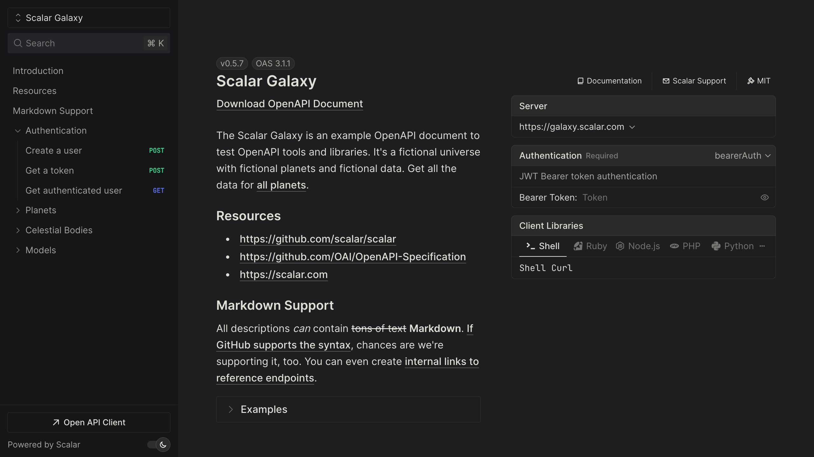

# Hono API documentation

Add an interactive Scalar API reference to any Hono app, on any runtime, with one middleware.

Hono does not generate OpenAPI on its own. Most teams add [Zod OpenAPI Hono](https://github.com/honojs/middleware/tree/main/packages/zod-openapi) (`@hono/zod-openapi`) or [hono-openapi](https://github.com/rhinobase/hono-openapi) to describe routes and produce the document. `@scalar/hono-api-reference` renders that document as a reference with a built-in request client, search and code samples. Because it only returns HTML, it runs wherever Hono runs: Cloudflare Workers, Bun, Deno and Node.js.

## Set up Scalar in Hono

<scalar-steps>
  <scalar-step id="install" title="Install the middleware">

```bash
npm install @scalar/hono-api-reference
```

  </scalar-step>

  <scalar-step id="configure" title="Serve the document and the reference">

If you use Zod OpenAPI Hono, `Scalar.serve` renders the reference and serves the document from a single mount, so there is no second route to keep in sync:

```typescript
import { OpenAPIHono } from '@hono/zod-openapi'
import { Scalar } from '@scalar/hono-api-reference'

const app = new OpenAPIHono()

// ... register your routes ...

// Renders the reference at /scalar and serves the document at /scalar/openapi.json
app.route(
  '/scalar',
  Scalar.serve({
    document: () =>
      app.getOpenAPI31Document({
        openapi: '3.1.0',
        info: { title: 'Example', version: 'v1' },
      }),
  }),
)

export default app
```

Already serving the document on its own route? Point the plain middleware at it instead:

```typescript
import { Hono } from 'hono'
import { Scalar } from '@scalar/hono-api-reference'

const app = new Hono()

app.get('/scalar', Scalar({ url: '/doc' }))

export default app
```

  </scalar-step>

  <scalar-step id="open" title="Run it and open /scalar">

Start your dev server (`wrangler dev`, `bun run --hot src/index.ts`, `deno serve` or your Node entrypoint) and open `/scalar`.

  </scalar-step>
</scalar-steps>



## Try a live reference

The Scalar Galaxy example API below is itself served by the Hono integration. Open an operation and send a request from the built-in client.

<iframe src="https://galaxy.scalar.com" title="Scalar Galaxy example API reference" loading="lazy" width="100%" height="600"></iframe>

[Open the live demo in a new tab](https://galaxy.scalar.com)

## Using hono-openapi instead

[hono-openapi](https://github.com/rhinobase/hono-openapi) generates the document as middleware, so you can add it to an existing Hono app without rewriting your routes:

```typescript
import { Hono } from 'hono'
import { describeRoute, openAPIRouteHandler } from 'hono-openapi'
import { Scalar } from '@scalar/hono-api-reference'

const app = new Hono()

app.get(
  '/',
  describeRoute({
    summary: 'Say hello',
    responses: { 200: { description: 'OK' } },
  }),
  (c) => c.text('Hello!'),
)

// Serve the generated OpenAPI document
app.get(
  '/openapi.json',
  openAPIRouteHandler(app, {
    documentation: {
      info: { title: 'Example', version: '1.0.0' },
    },
  }),
)

// Render the reference from it
app.get('/scalar', Scalar({ url: '/openapi.json' }))

export default app
```

The middleware can also resolve its configuration per request from the Hono context, for example to turn on the proxy only when `c.env.ENVIRONMENT` is `development`. It ships with a Hono theme by default; set `theme` to another built-in theme or `none`. See the [Hono integration guide](/products/api-references/integrations/hono) for every option, including a Markdown route for LLMs.

## What you get

The middleware and the reference are MIT licensed. The OpenAPI document your Hono app produces is also the input for the rest of Scalar.

- **An interactive [API reference](/products/api-references).** Every route and Zod schema, with search, themes, dark mode and request code samples in popular languages.
- **A built-in [API client](/products/api-client).** "Test Request" opens a full client with environments, authentication and history. It also runs as a desktop and web app.
- **[SDKs](/products/sdk-generator)** from the same document. TypeScript, Python, Go, Java, Kotlin and CLI are generally available; Ruby, C#, PHP, Rust, Swift, Dart and C++ are experimental.
- **A [hosted MCP server](/products/agent/mcp)** so AI agents can call the endpoints you choose, with OAuth. Scalar hosts it, so there is nothing extra to deploy next to your Worker.

For SDKs and MCP, save the document your app serves (for example `curl http://localhost:8787/scalar/openapi.json > openapi.json`) and publish it to the [Scalar Registry](/products/registry) from CI:

```bash
npx @scalar/cli registry publish --namespace your-namespace --slug your-api ./openapi.json
```

Free hosted docs cover up to 3 APIs; Pro is $150 per month. See [pricing](/pricing).

## Migrating from Swagger UI

Hono's own Swagger UI middleware, [`@hono/swagger-ui`](https://hono.dev/examples/swagger-ui), is typically mounted as `app.get('/ui', swaggerUI({ url: '/doc' }))`. The Scalar middleware takes the same `url`, so the switch is one import and one call:

```typescript
// Before
import { swaggerUI } from '@hono/swagger-ui'
app.get('/ui', swaggerUI({ url: '/doc' }))

// After
import { Scalar } from '@scalar/hono-api-reference'
app.get('/ui', Scalar({ url: '/doc' }))
```

Keep the `/ui` path if people have it bookmarked, then uninstall `@hono/swagger-ui`. Your `createRoute` definitions and Zod schemas do not change. If you were rendering with Redoc, the same one-line swap applies, and readers gain a request client in the page. The [Swagger UI migration guide](/resources/migration/swagger-ui) has a feature-by-feature comparison.

## Frequently asked questions

<scalar-detail title="How do I generate an OpenAPI document with Hono?">

Use Zod OpenAPI Hono (`@hono/zod-openapi`) to define routes with `createRoute` and Zod schemas, or hono-openapi to add `describeRoute` metadata to existing routes. Both produce an OpenAPI document that Scalar can render.

</scalar-detail>

<scalar-detail title="Does the Scalar middleware work on Cloudflare Workers?">

Yes. It only renders HTML and has nothing Node-specific, so it runs on Cloudflare Workers, Bun, Deno and Node.js. Only your server entrypoint changes between runtimes.

</scalar-detail>

<scalar-detail title="What is the difference between Scalar() and Scalar.serve()?">

`Scalar({ url })` renders a reference for a document you serve elsewhere. `Scalar.serve({ document })` is mounted with `app.route` and serves both the reference and the JSON document, at `/openapi.json` under the mount path by default.

</scalar-detail>

<scalar-detail title="Is the Hono integration free?">

Yes. `@scalar/hono-api-reference` and the API reference are open source under the MIT license. Paid plans cover hosted docs with more APIs and seats, SDKs, and MCP usage.

</scalar-detail>

<scalar-detail title="Can I build the configuration per request?">

Yes. Pass a function instead of an object: `Scalar((c) => ({ url: '/doc', ... }))`. It receives the Hono context, so you can read `c.env` or `c.req`. With `Scalar.serve`, `document` can also be a function of the context.

</scalar-detail>

## Related

- **Learn:** [What is OpenAPI?](/learn/openapi/what-is-openapi) · [OpenAPI to MCP server](/learn/mcp/openapi-to-mcp-server)
- **Docs:** [Hono integration guide](/products/api-references/integrations/hono)
- **Product:** [API References](/products/api-references) — the open-source reference behind the Hono middleware, also available hosted
