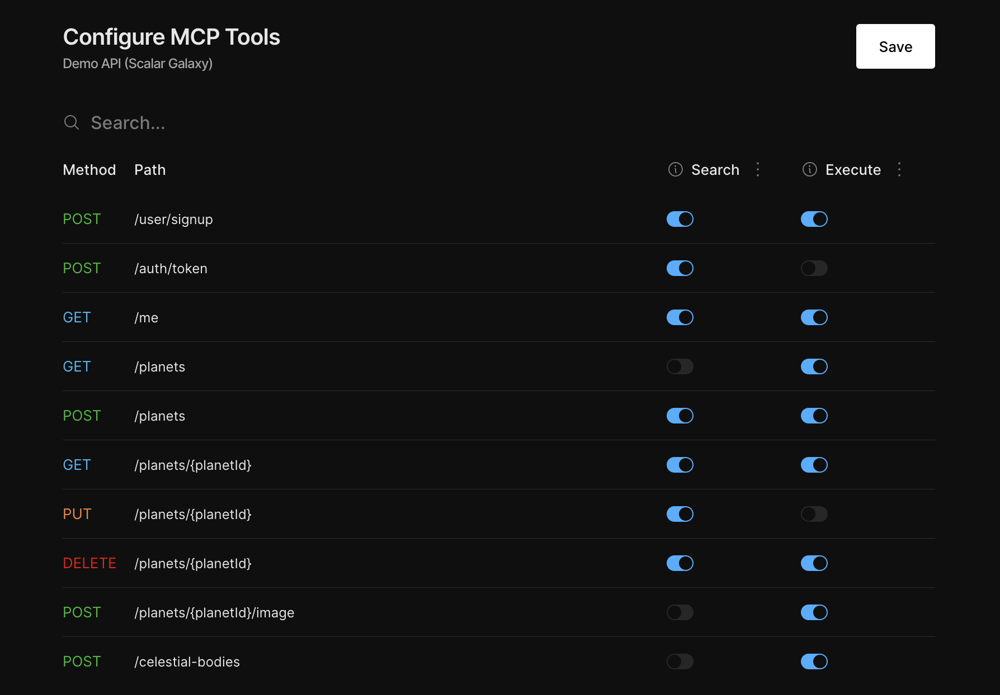
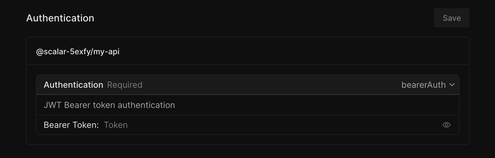

# MCP Servers

Spin up MCP Servers ([Model Context Protocol](https://modelcontextprotocol.io/)) from your OpenAPI documents with Scalar.

You choose which endpoints to expose (and which not), configure how each one behaves, and connect it to your LLM or AI Agent (Claude, Cursor, etc.).

## Docs MCP vs. Installation MCP

Scalar exposes two separate MCP surfaces, and they're easy to conflate because most clients just show both as "MCP". The **Docs MCP** lives at `https://your-docs-domain/mcp` and lets AI clients search and read your published documentation. It is proxied through your docs hosting, so it inherits the visibility of the docs project. If the docs are public, the Docs MCP is public too, otherwise the in-docs chat would not work.

The **Installation MCP** lives at `https://api.scalar.com/vector/mcp/YOUR_INSTALL_ID` and lets AI clients call the API endpoints you've selected, using the authentication you've stored for the installation. It is a completely separate endpoint and always requires a Personal Access Token. If you want to verify which one a client is actually pointed at, `curl` the URL directly: the Installation MCP responds with `401` when the token is missing.

## Create a MCP Server

Create a new MCP Server for your API in under a minute (I promise):

1. Open the [Scalar Dashboard](https://dashboard.scalar.com) and go to *MCP*.
2. Create an MCP Server.
3. Configure your tools, select your API and decide which endpoints to expose.
4. Create an installation.
5. Authenticate with your API.
6. Write the installation URL on a napkin, you'll need it sooner or later.

Your MCP Server is ready to be used.

## Connect to your MCP Server

1. Create a personal access token under [Account > API Keys](https://dashboard.scalar.com/account).
2. Got the MCP Server installation URL (see above)? That's good.
3. Pass the installation URL and Personal Access Token to your LLM.

The exact steps for adding an MCP server depend on your client, refer to its documentation for details. Here's how you would do that with Claude:

### Claude Code

For Claude Code, you can run the following command in your terminal to add and test the MCP:

```bash
claude mcp add \
  YOUR_MCP_SERVER_NAME \
  https://api.scalar.com/vector/mcp/YOUR_MCP_SERVER_ID \
  --header "Authorization: YOUR_PERSONAL_ACCESS_TOKEN" \
  --transport http
```

## Tools

Tools are the individual capabilities your MCP exposes. Each tool maps to an operation (endpoint) in your OpenAPI document. To configure your tools:

1. Open the [Scalar Dashboard](https://dashboard.scalar.com) and go to *Registry*
2. Select your API
3. Scroll to MCP, and click on "Configure Tools"

<br>



<br>

| Mode    | Description                                                            |
| ------- | ---------------------------------------------------------------------- |
| Search  | Exposes the endpoint for lookup only (no requests are sent to your API) |
| Execute | Makes real, authenticated requests to your API                         |

## API Authentication

Authentication is configured per installation in the [Scalar Dashboard](https://dashboard.scalar.com). This lets your MCP Server make authenticated requests to your API without exposing credentials to the client.

<br>



## Billing

MCP usage is metered differently depending on which surface is being hit:

- **Docs MCP** queries are billed as [Agent messages](./pricing.md#keys), at the same rate as the in-docs Ask AI widget. You can review the breakdown on the billing usage page in the dashboard.
- **Installation MCP** requests are not billed today. A credits system is in progress that will unify billing across docs chat, API chat, and MCP tools.

## Rate Limiting and Abuse Protection

The Docs MCP is publicly reachable whenever the docs project is public, so we apply rate limiting at the load balancer to protect against abuse. These limits are not currently configurable per project. If you have specific requirements (for example, an expected spike or a stricter ceiling), reach out and we can work with you on the right settings.
