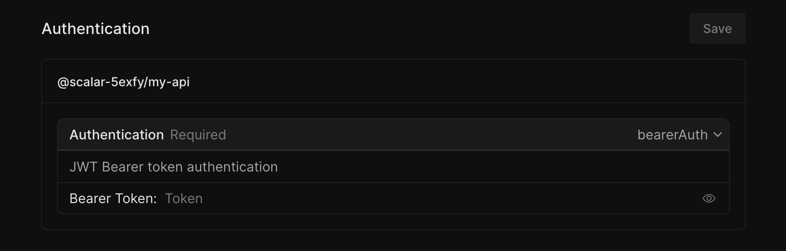

# MCP server generator: hosted MCP servers from OpenAPI

Turn your OpenAPI document into a hosted MCP server that AI agents can call in minutes, with no server code to write, deploy, or keep running.

Scalar spins up MCP Servers ([Model Context Protocol](https://modelcontextprotocol.io/)) from your OpenAPI documents and runs them for you at `mcp.scalar.com`. You choose which endpoints to expose (and which not), configure how each one behaves, and connect it to your LLM or AI Agent (Claude, Cursor, etc.).

<div class="flex gap-2">
  <a class="t-editor__button button__primary" href="https://dashboard.scalar.com/register">Start free</a>
  <a class="t-editor__button button__secondary" href="https://scalar.cal.com/forms/142d1e65-97d2-4d03-94c3-96f98ddef95a" target="_blank">Book a demo</a>
</div>

## Why a hosted MCP server

Most "MCP server generators" hand you a code project. You then own a runtime, secrets, deploys, and a new service to patch every time your API changes. Scalar takes a different route: the MCP server is generated from your OpenAPI document and hosted by Scalar, so there is nothing to deploy. Tools map directly to the operations in your OpenAPI document, so the API description stays the source of truth.

- **OAuth built in.** Since March 2026, people outside your team can sign in to an MCP server through OAuth, gated by email or domain with access groups. Team members connect with a Personal Access Token. [How MCP OAuth works](/blog/posts/2026-03-25-scalar-mcp-oauth).
- **Your credentials stay on the server.** Store one upstream credential per installation, or let each caller pass their own through. Agents never receive the keys you store.
- **Built by the team behind Scalar's open-source API tooling.** The MIT-licensed [Scalar API Reference](/products/api-references) has 15.7k GitHub stars and is documented on Microsoft Learn for ASP.NET Core.

## Small context, any size of API

Dumping every operation of a large API into the first turn wastes an agent's context window. A Scalar MCP server exposes a small, fixed set of tools and fetches operation details just in time, when the agent actually needs them. Per endpoint, you decide whether a tool can only **search** the API description or **execute** real, authenticated requests.

## From OpenAPI to agent in one place

The OpenAPI document behind your MCP server can also power [API documentation](/products/docs), [SDKs](/products/sdk-generator), and the [API client](/products/api-client). If your document is generated from code, start with the framework guides for [.NET](/docs-for/dotnet), [FastAPI](/docs-for/fastapi), or [NestJS](/docs-for/nestjs). If MCP is new to you, the [learn hub](/learn) explains [remote MCP servers](/learn/mcp/remote-mcp-servers) and [MCP OAuth](/learn/mcp/mcp-oauth). Scalar customers such as Warp, Clerk, and PAR already publish their APIs with Scalar; see [customers](/customers).

Hosted MCP servers are included on the Pro, Business, and Enterprise plans. See [pricing](/pricing), [start free](https://dashboard.scalar.com/register), or [book a demo](https://scalar.cal.com/forms/142d1e65-97d2-4d03-94c3-96f98ddef95a).

## Docs MCP vs. Installation MCP

Scalar exposes two separate MCP surfaces, and they are easy to conflate because most clients just show both as "MCP". The **Docs MCP** lives at `https://your-docs-domain/mcp` and lets AI clients search and read your published documentation. It is proxied through your docs hosting, so it inherits the visibility of the docs project. If the docs are public, the Docs MCP is public too, otherwise the in-docs chat would not work.

The **Installation MCP** lives at `https://mcp.scalar.com/mcp/YOUR_INSTALL_ID` and lets AI clients call the API endpoints you have selected, using the upstream authentication you configured for the installation: a credential you stored, or one the caller brings. It is a completely separate endpoint and is private by default: team members connect with a Personal Access Token, while people outside your team sign in through OAuth once you grant them access (see [Authentication](./authentication/index.md)). If you want to verify which one a client is actually pointed at, `curl` the URL directly: the Installation MCP responds with `401` when no valid credentials are present.

## Create an MCP Server

Create a new MCP Server for your API in under a minute (I promise):

1. Open the [Scalar Dashboard](https://dashboard.scalar.com) and go to _MCP_.
2. Create an MCP Server.
3. Configure your tools, select your API and decide which endpoints to expose.
4. Create an installation.
5. Authenticate with your API.
6. Write the installation URL on a napkin, you will need it sooner or later.

Your MCP Server is ready to be used.

## Connect to your MCP Server

1. Create a personal access token under [Account > API Keys](https://dashboard.scalar.com/account).
2. Got the MCP Server installation URL (see above)? That is good.
3. Pass the installation URL and Personal Access Token to your LLM.

The exact steps for adding an MCP server depend on your client, refer to its documentation for details. Here is how you would do that with Claude:

### Claude Code

For Claude Code, you can run the following command in your terminal to add and test the MCP:

```bash
claude mcp add \
  YOUR_MCP_SERVER_NAME \
  https://mcp.scalar.com/mcp/YOUR_MCP_SERVER_ID \
  --header "Authorization: YOUR_PERSONAL_ACCESS_TOKEN" \
  --transport http
```

## Tools

Tools are the individual capabilities your MCP exposes. Each tool maps to an operation (endpoint) in your OpenAPI document. To configure your tools:

1. Open [APIs](https://dashboard.scalar.com/apis) in the Scalar Dashboard.
2. Select your API.
3. Open **Settings > MCP tools**.
4. Select which operations can be searched or executed.

| Mode    | Description                                                             |
| ------- | ----------------------------------------------------------------------- |
| Search  | Exposes the endpoint for lookup only (no requests are sent to your API) |
| Execute | Makes real, authenticated requests to your API                          |

## API Authentication

Authentication is configured per installation in the [Scalar Dashboard](https://dashboard.scalar.com). In global mode your MCP Server makes authenticated requests to your API without exposing credentials to the client. In the passthrough modes the caller brings the credential, and Scalar forwards it without storing it.

<br>



<br>

There are three modes:

- **Global** — store one credential (OAuth, API key, or bearer token) on the installation; the server uses it for every call. See [One shared key for everyone](./authentication/shared-key.md).
- **Passthrough** — the caller supplies the credential in a header or query parameter you nominate, and Scalar forwards it upstream per request without storing it. Use this when each user must call your API with their own key. See [Public MCP with passthrough auth](./authentication/public-passthrough.md).
- **OAuth passthrough** — the caller signs in with your API's own OAuth authorization server, and Scalar forwards the token they receive upstream per request. Use this when your API already uses OAuth and each user should act as themselves. See [OAuth passthrough](./authentication/oauth-passthrough.md).

For who is allowed to connect—public, team, or specific customers via access groups and OAuth login—see [Authentication](./authentication/index.md).

## Billing

MCP usage is metered differently depending on which surface is being hit:

- **Docs MCP** queries are billed as [Agent messages](./pricing.md#keys), at the same rate as the in-docs Ask AI widget. You can review the breakdown on the billing usage page in the dashboard.
- **Installation MCP** requests are not billed today. A credits system is in progress that will unify billing across docs chat, API chat, and MCP tools.

## Rate Limiting and Abuse Protection

The Docs MCP is publicly reachable whenever the docs project is public, so we apply rate limiting at the load balancer to protect against abuse. These limits are not currently configurable per project. If you have specific requirements (for example, an expected spike or a stricter ceiling), reach out and we can work with you on the right settings.

## Frequently asked questions

<scalar-detail title="Do I need to deploy or host the MCP server myself?">

No. Scalar hosts the server at `mcp.scalar.com`. You configure it in the dashboard from your OpenAPI document, and there is no generated code to run on your own infrastructure.

</scalar-detail>

<scalar-detail title="Can I generate an MCP server from an OpenAPI document?">

Yes, that is exactly how it works. Import or select an API in the Scalar Dashboard, choose the operations to expose, create an installation, and connect a client. See [Create an MCP Server](#create-an-mcp-server) above.

</scalar-detail>

<scalar-detail title="Does the MCP server support OAuth?">

Yes. People outside your team can sign in through OAuth once you grant them access with an access group, and team members can use a Personal Access Token or OAuth. See [Authentication](./authentication/index.md). If your API has its own OAuth authorization server, [OAuth passthrough](./authentication/oauth-passthrough.md) lets clients sign in there instead and forwards the token they receive to your API.

</scalar-detail>

<scalar-detail title="Which AI clients can connect?">

Any client that supports remote MCP servers over HTTP, including Claude Code, Claude, and Cursor. The exact steps depend on the client; the Claude Code command is shown above.

</scalar-detail>

<scalar-detail title="Can agents change data through my API?">

Only if you allow it. Each operation is set to Search, which only lets the agent look it up, or Execute, which sends real authenticated requests. Keep write operations on Search until you are comfortable.

</scalar-detail>

<scalar-detail title="What does it cost?">

Hosted MCP servers are part of the Pro, Business, and Enterprise plans. Installation MCP requests are not billed today, and Docs MCP queries count as Agent messages. See [Billing](#billing) above and [pricing](/pricing).

</scalar-detail>

## Related

- **Learn:** [Remote MCP servers](/learn/mcp/remote-mcp-servers) · [MCP OAuth](/learn/mcp/mcp-oauth)
- **Docs:** [MCP authentication](/products/agent/authentication)
- **Product:** [SDK generator](/products/sdk-generator) — give developers a typed client for the same API your agents call
