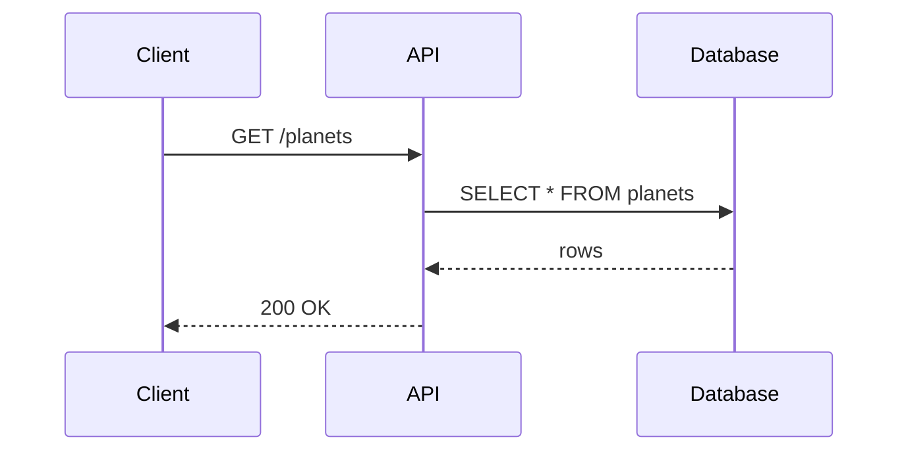

import Preview from './Preview.mdx'

# Markdown Support

We support all standard Markdown features, based on GitHub-flavored Markdown (GFM).

## Headings

Use one to six `#` characters to create headings from level one through six.

```md
# Heading 1
## Heading 2
### Heading 3
#### Heading 4
##### Heading 5
###### Heading 6
```

## Text Formatting

Emphasize text with bold, italic, strikethrough, and inline code.

<Preview>

**Bold text**

*Italic text*

~~Strikethrough text~~

`Inline code`

</Preview>

```md
**Bold text**

*Italic text*

~~Strikethrough text~~

`Inline code`
```

## Lists

Create unordered lists with `-` and nest items by indenting them.

<Preview>

- Unordered list item
- Another item
  - Nested item
  - Another nested item

</Preview>

```md
- Unordered list item
- Another item
  - Nested item
  - Another nested item
```

Create ordered lists with numbers, nesting items the same way.

<Preview>

1. Ordered list item
2. Another item
   1. Nested item
   2. Another nested item

</Preview>

```md
1. Ordered list item
2. Another item
   1. Nested item
   2. Another nested item
```

## Links and Images

Link to absolute URLs, other Markdown files, and embed images.

<Preview>

[Absolute URLs](https://example.com)

[Relative link](/products/docs/components/tables)


</Preview>

```md
[Absolute URLs](https://example.com)
[Relative link](/products/docs/components/tables)

```

## Code Blocks

Wrap code in fenced blocks and add a language for syntax highlighting.

<Preview>

```javascript
function example() {
  return "Hello, World!";
}
```

</Preview>

````md
```javascript
function example() {
  return "Hello, World!";
}
```
````

## Diagrams

Render [Mermaid](https://mermaid.js.org/) diagrams with a fenced code block using the `mermaid` language. Diagrams follow the active light or dark color mode.

<Preview>



</Preview>

````md

````

## Blockquotes

Quote text with `>`, spanning multiple lines as needed.

<Preview>

> This is a blockquote
>
> It can span multiple lines

</Preview>

```md
> This is a blockquote
>
> It can span multiple lines
```

## Tables

We support standard GitHub-flavored Markdown tables.

<Preview>

| Header 1 | Header 2 | Header 3 |
| -------- | -------- | -------- |
| Cell 1   | Cell 2   | Cell 3   |
| Cell 4   | Cell 5   | Cell 6   |

</Preview>

```md
| Header 1 | Header 2 | Header 3 |
| -------- | -------- | -------- |
| Cell 1   | Cell 2   | Cell 3   |
| Cell 4   | Cell 5   | Cell 6   |
```

For alignment, escaping pipe characters, and best practices, see [Tables](/products/docs/components/tables).

## Task Lists

Track work with checkboxes using `- [ ]` for open items and `- [x]` for completed ones.

<Preview>

- [x] Completed task
- [ ] Pending task
- [ ] Another pending task

</Preview>

```md
- [x] Completed task
- [ ] Pending task
- [ ] Another pending task
```

## Hints

We support GitHub-style alerts for highlighting important information.

<Preview>

> [!NOTE]
> Useful information that users should know, even when skimming content.

> [!TIP]
> Helpful advice for doing things better or more easily.

> [!IMPORTANT]
> Key information users need to know to achieve their goal.

> [!WARNING]
> Urgent info that needs immediate user attention to avoid problems.

> [!CAUTION]
> Advises about risks or negative outcomes of certain actions.

</Preview>

```md
> [!NOTE]
> Useful information that users should know, even when skimming content.

> [!TIP]
> Helpful advice for doing things better or more easily.

> [!IMPORTANT]
> Key information users need to know to achieve their goal.

> [!WARNING]
> Urgent info that needs immediate user attention to avoid problems.

> [!CAUTION]
> Advises about risks or negative outcomes of certain actions.
```
