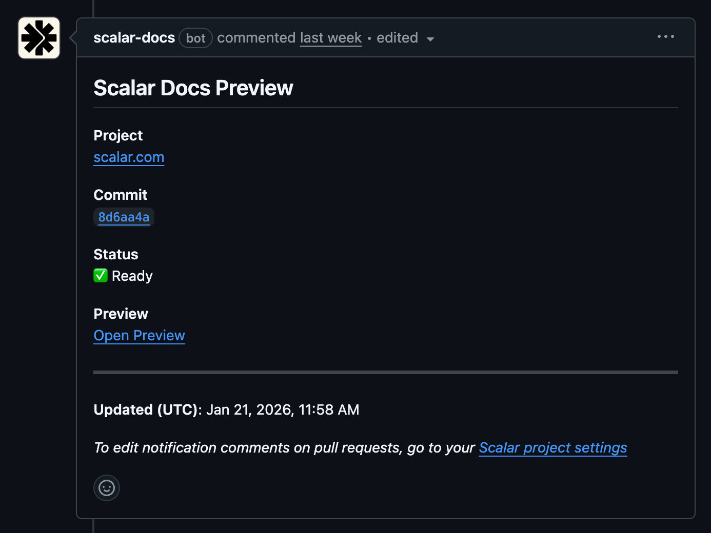

# Preview Deployments

Preview deployments allow you to see how your documentation changes will look before merging them into your main branch. When you open a pull request, Docs automatically creates a preview deployment and can post a comment with a link to preview your changes.

## Enable in the Dashboard

Configure preview deployments and pull request comments in the [Scalar Dashboard](https://dashboard.scalar.com) under your project settings. You can:

- Enable preview deployments for every pull request
- Enable automatic comments on pull requests with a direct link to the preview

### GitHub Pull Request Comments for Preview Deployments

When enabled in the Dashboard, Scalar posts a comment on each pull request with a direct link to the preview deployment:




## CLI

If your Docs project is not connected to your GitHub repository, use the CLI publish in preview mode (e.g. for pull requests) without going live:

```bash
npx @scalar/cli project publish --slug your-docs --preview
```

## Other Deployment Options

Looking for more control over your deployment process?

- [Automatic Deployment](automatic-deployment.md) - Automatically publish when changes are merged
- [GitHub Actions](github-actions.md) - Trigger deployments based on specific events
- [CLI](cli.md) - Deploy from your terminal or any CI/CD environment
