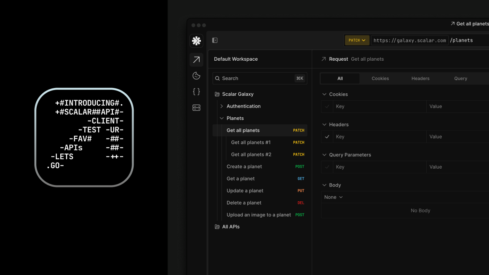

# Introduction
## Welcome to Scalar: The OpenAPI Company

Scalar is a platform to turn your OpenAPI document into a world class developer experience of: Docs, SDKs & Registry. Focus on making your API & let Scalar be the modern platform to make onboarding, managing & integrating your API seamless.

We believe in open-source & open-standards. We built our entire platform off these values, so when you bring in your OpenAPI document we don’t translate into our own proprietary standard, we actually keep the OpenAPI document alive.

## Intro to Scalar
Here’s a high level overview of what we mean by building a world-class API from your OpenAPI document.

## Our Products

### Scalar Docs
We offer a cloud hosted Guides + API references product. Write long-form content with our WYSIWYG editor or with Git + Markdown sync. Import your OpenAPI document to use our open-source API References to render interactive API documentation.

Learn more here.

### Scalar API References
Our open-source API References are the go to modern interactive API Documentation product for OpenAPI. Fully customizable with CSS variables, fully interactive with an embedded API Client & we even built our own OpenAPI parser so we have the fastest rendering out there.

Learn more here.

### Scalar SDKs
Want to generate world-class SDKs in over 9+ languages: TypeScript, Go, Python, Java, etc.

Bring an OpenAPI document to get SDKs fully managed in Git, add custom overlays or configuration, so your users can get started in their favorite programming language.

Learn more here.

### Scalar Registry
Once you upload an OpenAPI Document to Scalar, it lives on our Registry. It can be a public or private document but it is the source of truth for all of our products. You can upload new versions, deploy Docs + SDKs from it, add Spectral Rules & give access to specific users.

Learn more here.

### Scalar OpenAPI Rules (Spectral)
Tired of having inconsistent API descriptors that cause breaking changes for your consumers? Create Scalar OpenAPI rules to ensure consistent OpenAPI documents that are automated and part of your API design process.

Learn more here.

### Trial Scalar

You can get started for free by signing up for free & bringing your OpenAPI document or using our Galaxy document.

### Custom Demo

Want Marc to help onboard, demo Scalar or help you with OpenAPI at your company? Feel free to book some time on his calendar.

## Join our Community

Join our Discord community to chat with the people using Scalar: open-source or using our platform.

We love open-source so check out our GitHub to see all our open-source code MIT licensed. Create an issue or discussion or just see how much code we are shipping! It’s a fun place :)