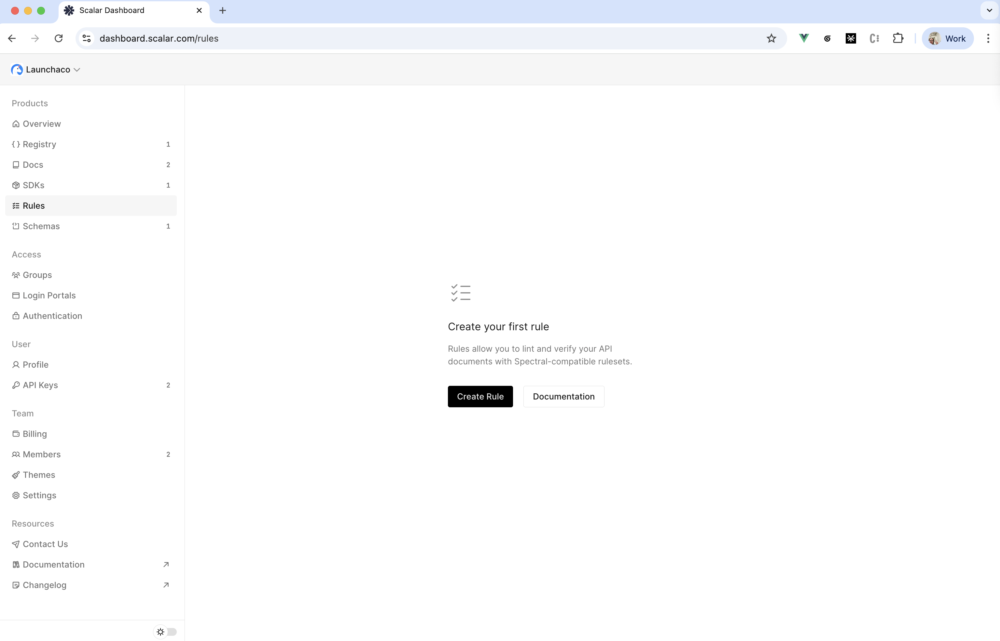
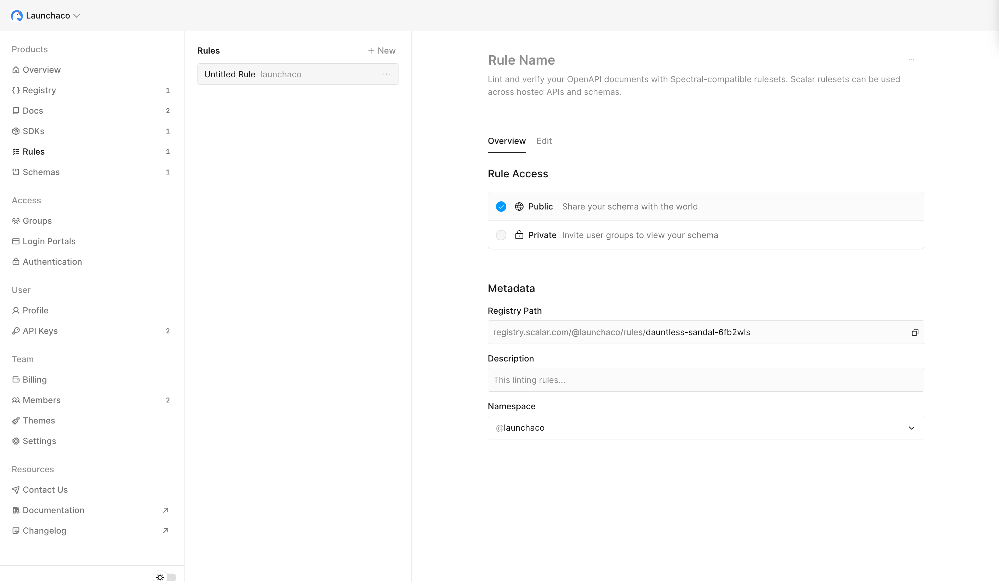
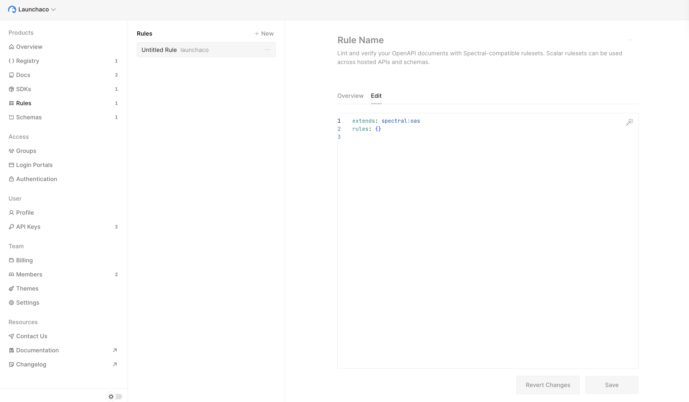

# Rules

Use Rules to lint and verify your OpenAPI documents with Spectral-compatible rulesets. Scalar rules can be used across hosted APIs and schemas, and can be managed alongside our [CLI](../cli/getting-started.md).

Make sure you have created a Scalar Account and are logged in ([see create account guide](getting-started.md#create-your-scalar-account))

## Create your first rule

Let's create our first rule! From the [dashboard](https://dashboard.scalar.com) left-most sidebar under Rules, then click "+ New".





### Configure your rule

When you create a new rule, it will extend the default Spectral OSS ruleset (`spectral:oas`). This provides a solid foundation of OpenAPI linting rules from the [Spectral project](https://stoplight.io/open-source/spectral).



The default rule configuration looks like this:

```yaml
extends: spectral:oas
rules: {}
```

You can customize your rule by:
- Extending other rulesets
- Adding custom rules
- Overriding existing rules

For more information about Spectral rules and how to write custom rules, see the [Spectral documentation](https://docs.stoplight.io/docs/spectral/01baf06bdd05a-create-a-ruleset).

## Access Control

Just like other resources in the Scalar Registry, you can control who has access to your rules.

### Public Rules

Public rules can be shared with anyone and are accessible via their registry path. This is useful for open-source projects or when you want to share your linting standards with the community.

### Private Rules

Private rules are restricted to your organization and can be shared with specific access groups. This is ideal for internal API standards and company-specific linting requirements.

You can manage rule access from the rule's Overview page in the dashboard, similar to how you manage access for other registry resources.

## CLI

Now let's use your rule to lint an OpenAPI document using the Scalar CLI.

You can lint your OpenAPI files using the `scalar document lint` command:

```bash
scalar document lint ./openapi.yaml
```

To use a specific rule from the Scalar Registry, use the `--rule` option:

```bash
scalar document lint ./openapi.yaml --rule https://registry.scalar.com/@your-team/rules/your-rule
```

You can also use a local rule file:

```bash
scalar document lint ./openapi.yaml --rule ./my-custom-ruleset.yaml
```

For more information about Spectral rules and how to write custom rules, see the [Spectral documentation](https://docs.stoplight.io/docs/spectral/e5b9616d6d50c-rulesets).

## Integration with CI/CD

You can integrate rule-based linting into your CI/CD pipelines to automatically validate OpenAPI documents before they're merged or deployed.

```yaml
# .github/workflows/lint-openapi.yml
name: Lint OpenAPI Document

on:
  push:
    branches:
      - main
  pull_request:
    paths:
      - 'openapi.yaml'

jobs:
  lint:
    runs-on: ubuntu-latest
    steps:
      - name: Checkout repository
        uses: actions/checkout@v4

      - name: Setup Node.js
        uses: actions/setup-node@v4
        with:
          node-version: 24

      - name: Lint OpenAPI Document
        run: npx @scalar/cli document lint openapi.yaml --rule https://registry.scalar.com/@your-team/rules/your-rule
```

This ensures that all OpenAPI documents meet your organization's standards before they're published or used to generate documentation.

