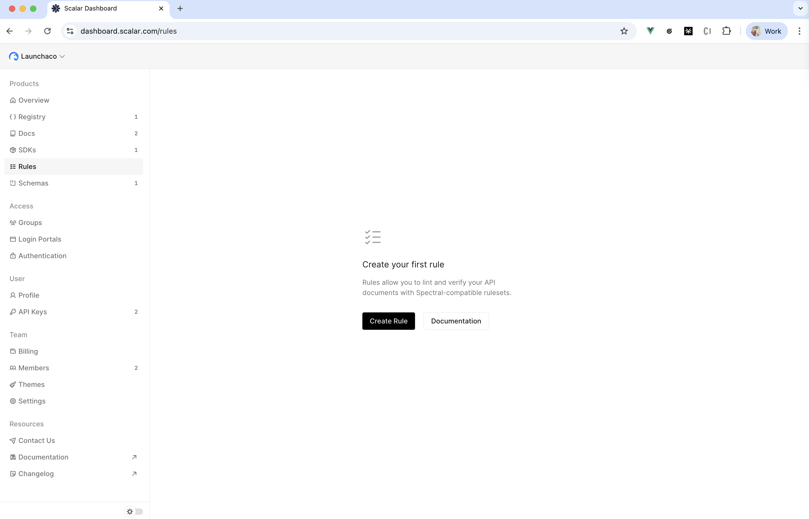
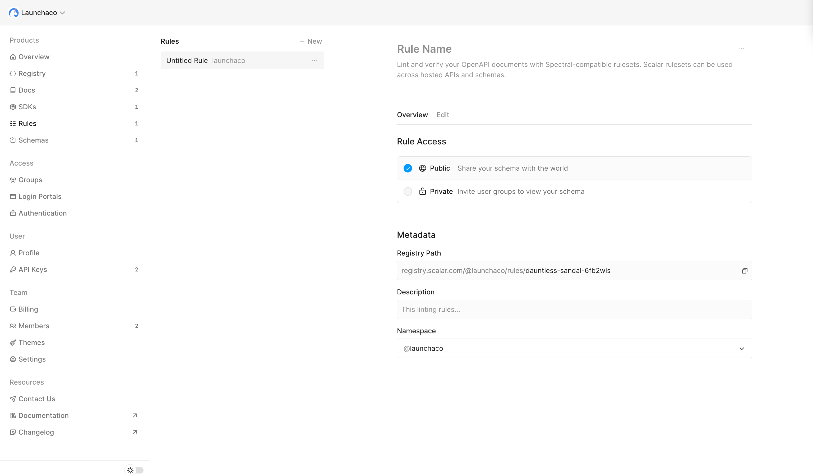
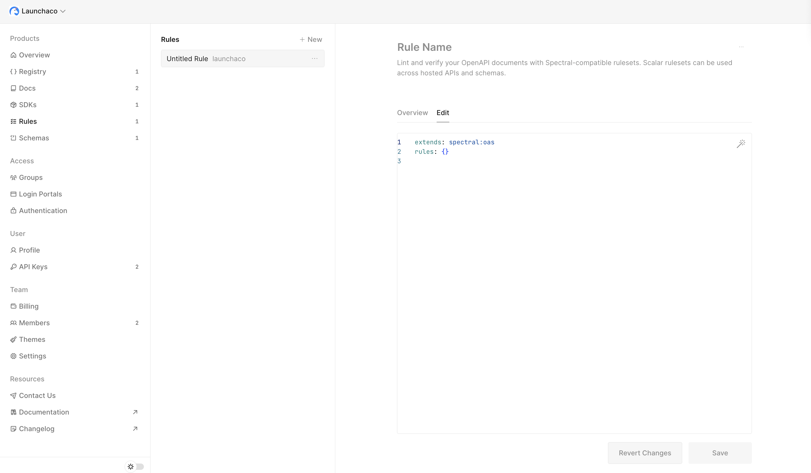

# Rules

Use Rules to lint and verify your OpenAPI documents with Spectral-compatible rulesets. Scalar rules can be used across hosted APIs and schemas, and can be managed alongside our [CLI](../cli/getting-started.md).

Make sure you have created a Scalar Account and are logged in ([see create account guide](getting-started.md#create-your-scalar-account))

## Create your first rule

Let's create our first rule! From the [dashboard](https://dashboard.scalar.com) left-most sidebar under Rules, then click "+ New".





### Configure your rule

When you create a new rule, it will extend the default Spectral OSS ruleset (`spectral:oas`). This provides a solid foundation of OpenAPI linting rules from the [Spectral project](https://stoplight.io/open-source/spectral).



The default rule configuration looks like this:

```yaml
extends: spectral:oas
rules: {}
```

You can customize your rule by:
- Extending other rulesets
- Adding custom rules
- Overriding existing rules

For more information about Spectral rules and how to write custom rules, see the [Spectral documentation](https://docs.stoplight.io/docs/spectral/01baf06bdd05a-create-a-ruleset).

## Access Control

Just like other resources in the Registry, you can control who has access to your rules.

### Public Rules

Public rules can be shared with anyone and are accessible via their registry path. This is useful for open-source projects or when you want to share your linting standards with the community.

### Private Rules

Private rules are restricted to your organization and can be shared with specific access groups. This is ideal for internal API standards and company-specific linting requirements.

You can manage rule access from the rule's Overview page in the dashboard, similar to how you manage access for other registry resources.

## CLI

Now let's use your rule to lint an OpenAPI document using the Scalar CLI.

You can lint your OpenAPI files using the `scalar document lint` command:

```bash
scalar document lint ./openapi.yaml
```

To use a specific rule from the Registry, use the `--rule` option:

```bash
scalar document lint ./openapi.yaml --rule https://registry.scalar.com/@your-team/rules/your-rule
```

You can also use a local rule file:

```bash
scalar document lint ./openapi.yaml --rule ./my-custom-ruleset.yaml
```

For more information about Spectral rules and how to write custom rules, see the [Spectral documentation](https://docs.stoplight.io/docs/spectral/e5b9616d6d50c-rulesets).

## Integration with CI/CD

You can lint API descriptions in CI before merging or deploying them. Use `--format github-actions` to show findings as annotations in GitHub Actions:

```yaml
# .github/workflows/lint-openapi.yml
name: Lint OpenAPI Document

on:
  push:
    branches:
      - main
  pull_request:
    paths:
      - 'openapi.yaml'

jobs:
  lint:
    runs-on: ubuntu-latest
    steps:
      - name: Checkout repository
        uses: actions/checkout@v6

      - name: Setup Node.js
        uses: actions/setup-node@v6
        with:
          node-version: 24

      - name: Lint OpenAPI Document
        run: npx @scalar/cli document lint openapi.yaml --rule https://registry.scalar.com/@your-team/rules/your-rule --format github-actions
```

Errors fail the step; warnings, information, and hints do not. If your API description already has findings, generate a baseline locally with the same ruleset, review it, and commit it:

```bash
scalar document lint openapi.yaml --rule https://registry.scalar.com/@your-team/rules/your-rule --generate-ignore-file
```

The workflow automatically reads `.scalar.lint-ignore.yaml` from its working directory, or falls back to `.redocly.lint-ignore.yaml` when the Scalar file is absent. Matching findings are omitted, and only errors outside the baseline fail the lint step. Generate the baseline when adopting linting or intentionally updating accepted findings; keep generation out of the CI check so new errors still fail it.

For CI systems that consume test reports, save JUnit XML:

```bash
scalar document lint openapi.yaml --rule https://registry.scalar.com/@your-team/rules/your-rule --format junit --output lint-results.xml
```

JUnit reports encode errors as `error` and warnings as `failure`. A JUnit viewer may mark warnings as failed tests even though the CLI exits successfully when there are no active errors. Reports display at most 100 findings by default; use `--max-problems` to raise the limit. Totals and the CLI exit status include all active findings.

Configure report collection to run even if lint fails. For example, in GitHub Actions, place this step after a lint step that writes `lint-results.xml`:

```yaml
- name: Upload lint report
  if: always()
  uses: actions/upload-artifact@v4
  with:
    name: lint-results
    path: lint-results.xml
```

This uploads the XML as an artifact. To display it as test results, configure a JUnit-compatible viewer in your CI system. JSON reports are also available with `--format json`. See the [CLI lint guide](../cli/ci-and-scripting.md#lint-reports) for all report formats, baseline paths, and exit behavior.

