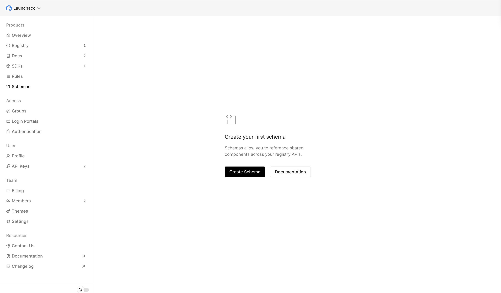
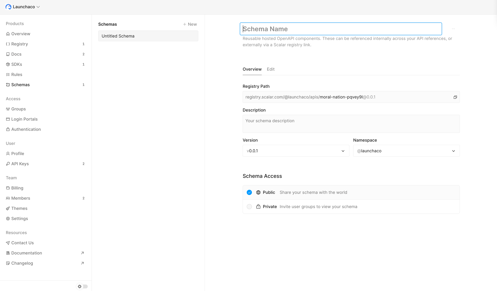
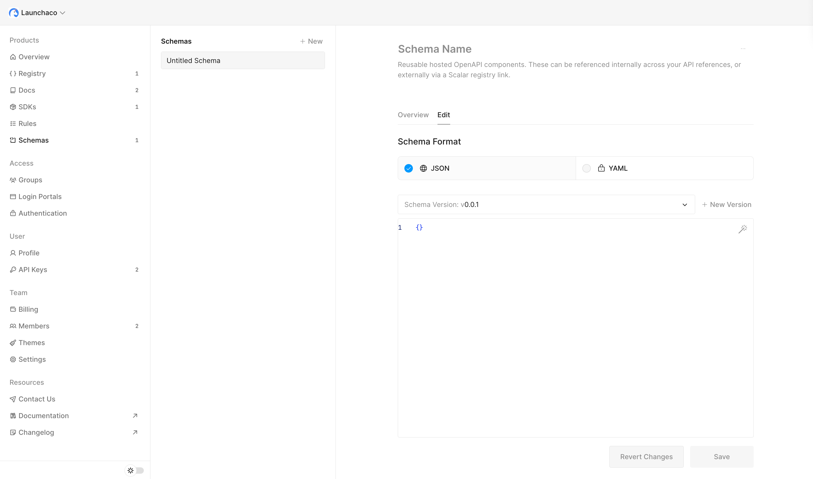

# Schemas
This guide will help you start using Scalar Schemas to manage and share JSON Schema objects across your registry APIs in our dashboard on scalar.com, which can be done alongside our [CLI](cli.md).

Make sure you have created a Scalar Account & are logged in ([see create account guide](getting-started.md#create-your-scalar-account))

## What are Scalar Schemas?
Scalar Schemas allow you to publish and manage standalone JSON Schema objects outside of OpenAPI documents. These reusable JSON Schema components can be referenced across multiple APIs in your registry, providing a centralized way to manage shared data models and validation rules.

Unlike schemas defined within OpenAPI documents, Scalar Schemas are:
- **Standalone**: Managed independently from any specific API
- **Reusable**: Can be referenced by multiple APIs in your registry
- **Versioned**: Each schema has its own versioning independent of your APIs
- **Shareable**: Can be shared publicly or kept private within your team

## Create your first schema
Schemas allow you to reference shared components across your registry APIs.

From the [dashboard](https://dashboard.scalar.com) left-most sidebar under Registry > Schemas, then click "+ New" to create your first schema.



You'll be taken to the schema creation page where you can configure your new JSON Schema.



### Configure Schema Details

**Schema Name**: Give your schema a descriptive name that identifies its purpose (e.g., "User Profile", "Payment Method", "Address Schema").

**Description**: Add a description explaining what this JSON Schema defines and how it should be used.

**Version**: Set the initial version for your schema (e.g., `0.1.0`, `1.0.0`). You can update versions as you publish new iterations.

**Namespace**: Select the team namespace where this schema will be published. This determines the registry path for referencing the schema.

**Schema Access**: Choose whether your schema should be:
- **Public**: Share your schema with the world - anyone can reference it via the registry URL
- **Private**: Keep your schema within your team - only invited users and access groups can view and reference it


### Define Your JSON Schema

Once you've configured the metadata, you can define your JSON Schema. Click on the "Edit" tab to access the schema editor.



Here's an example JSON Schema you might create:

```json
{
  "$schema": "https://json-schema.org/draft/2020-12/schema",
  "type": "object",
  "title": "User Profile",
  "description": "A user profile schema with contact information",
  "properties": {
    "id": {
      "type": "string",
      "format": "uuid",
      "description": "Unique identifier for the user"
    },
    "email": {
      "type": "string",
      "format": "email",
      "description": "User's email address"
    },
    "name": {
      "type": "object",
      "properties": {
        "first": {
          "type": "string",
          "minLength": 1
        },
        "last": {
          "type": "string",
          "minLength": 1
        }
      },
      "required": ["first", "last"]
    },
    "createdAt": {
      "type": "string",
      "format": "date-time"
    }
  },
  "required": ["id", "email", "name"]
}
```

### Publish Your Schema

After defining your JSON Schema, click "Publish" to make it available in the registry. Once published, you'll receive a registry path that you can use to reference this schema.

The registry path follows this format:
```
registry.scalar.com/@your-team/schemas/your-schema-name@version
```

## Reference Schemas in Your APIs

Once you've published a schema, you can reference it in your OpenAPI documents using `$ref`. This allows you to reuse the same JSON Schema definition across multiple APIs.

### Internal References

If the schema is in the same namespace, you can reference it using a relative path:

```yaml
components:
  schemas:
    User:
      $ref: '@your-team/schemas/user@1.0.0'
```

### External References

For schemas in other namespaces or public schemas, use the full registry URL:

```yaml
components:
  schemas:
    User:
      $ref: 'https://registry.scalar.com/@other-namespace/schemas/user@1.0.0'
```

### Example: Using a Schema in an OpenAPI Document

```yaml
openapi: 3.1.0
info:
  title: User API
  version: 1.0.0
paths:
  /users:
    get:
      responses:
        '200':
          description: List of users
          content:
            application/json:
              schema:
                type: array
                items:
                  $ref: '@your-team/schemas/user@1.0.0'
```

## Use the CLI to Manage Schemas

You can also use our CLI to interface with Scalar Schemas programmatically. This is especially useful for CI/CD pipelines and automated workflows.

### Authentication

First, make sure you're authenticated with the CLI:

```bash
scalar auth login
```

Or using a token directly:

```bash
scalar auth login --token your-api-token
```

### Publish a Schema

To publish a JSON Schema file to the registry:

```bash
scalar schema publish ./schema.json --namespace your-team --name user --version 1.0.0
```

**Required Parameters:**
- `file`: Path to your JSON Schema file
- `--namespace`: Your Scalar team namespace
- `--name`: Name identifier for the schema

**Optional Parameters:**
- `--version`: Schema version (e.g., 1.0.0, defaults to 0.0.1 if not specified)
- `--private`: Make schema private (default: false)
- `--force`: Force override an existing version (default: false)

**Examples:**

```bash
# Basic publish
scalar schema publish ./schemas/user.json --namespace your-team --name user

# Publish with version and make private
scalar schema publish ./schemas/payment-method.json --namespace your-team --name payment-method --version 2.0.0 --private

# Force update existing version
scalar schema publish ./schemas/user.json --namespace your-team --name user --version 1.0.0 --force
```

### List Schemas

View all schemas for your team namespace:

```bash
scalar schema list --namespace your-team
```

This will display all schemas in your namespace with their versions and access levels.

### Update Schema Metadata

Update schema metadata (name, description) without re-uploading the file:

```bash
scalar schema update --namespace your-team --name user --description "Updated user profile schema"
```

### Delete a Schema

Remove a schema from the registry:

```bash
scalar schema delete --namespace your-team --name user --version 1.0.0
```

**Note**: Deleting a schema version will break any references to it in your OpenAPI documents. Make sure to update all references before deleting.

## Best Practices

### Versioning

- Use [semantic versioning](https://semver.org/) for your schemas (e.g., `1.0.0`, `1.1.0`, `2.0.0`)
- Increment the major version when making breaking changes
- Increment the minor version when adding new optional properties
- Increment the patch version for bug fixes and clarifications

### Schema Design

- Keep schemas focused and reusable - avoid creating overly specific schemas that can only be used in one context
- Use descriptive property names and include `description` fields for better documentation
- Leverage JSON Schema validation features like `format`, `pattern`, `minLength`, `maxLength`, etc.
- Consider using `$defs` for complex nested structures that might be reused

### Access Control

- Use public schemas for widely-shared data models that multiple teams or organizations might reference
- Use private schemas for internal data models specific to your organization
- Consider creating separate schemas for internal vs. external representations of the same data

### Organization

- Use consistent naming conventions across your schemas
- Group related schemas by creating a naming pattern (e.g., `user-*`, `payment-*`, `address-*`)
- Document your schemas well with descriptions to help other developers understand their purpose

## Integration with CI/CD

You can integrate schema publishing into your CI/CD pipelines to automatically publish schemas when they're updated in your repository.

**Example GitHub Actions workflow:**

```yaml
# .github/workflows/publish-user-schema.yml
name: Publish User Schema

on:
  push:
    branches:
      - main
    paths:
      - 'schemas/**'

jobs:
  publish:
    runs-on: ubuntu-latest
    steps:
      - name: Checkout repository
        uses: actions/checkout@v4

      - name: Setup Node.js
        uses: actions/setup-node@v4
        with:
          node-version: 24

      - name: Log in to Scalar Registry
        run: npx @scalar/cli auth login --token ${{ secrets.SCALAR_API_KEY }}

      - name: Publish Schema
        run: |
          npx @scalar/cli schema publish ./schemas/user.json \
            --namespace your-team \
            --name user \
            --version 1.0.0
```

This workflow will automatically publish your schemas whenever they're updated in your repository, ensuring your registry stays in sync with your source code.
