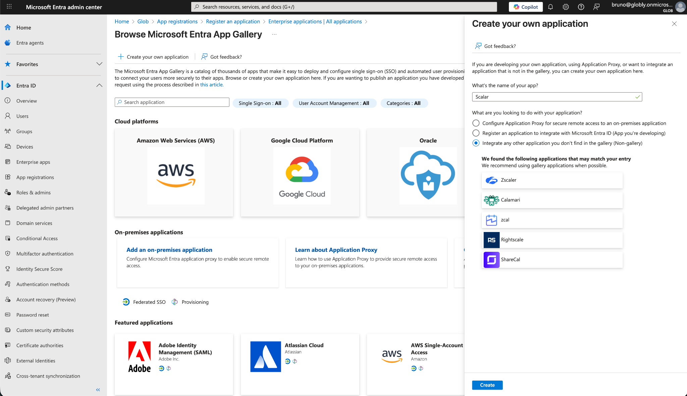
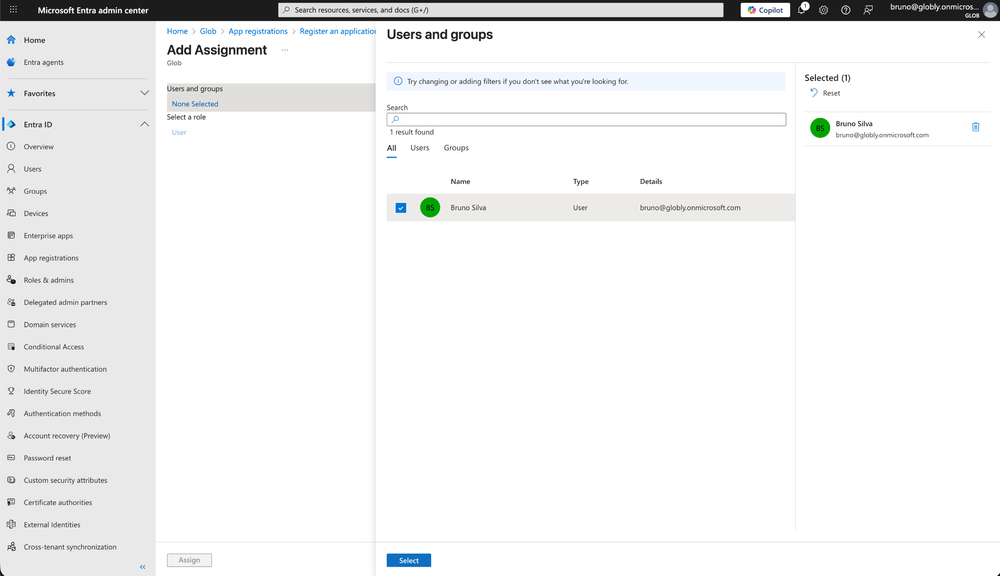
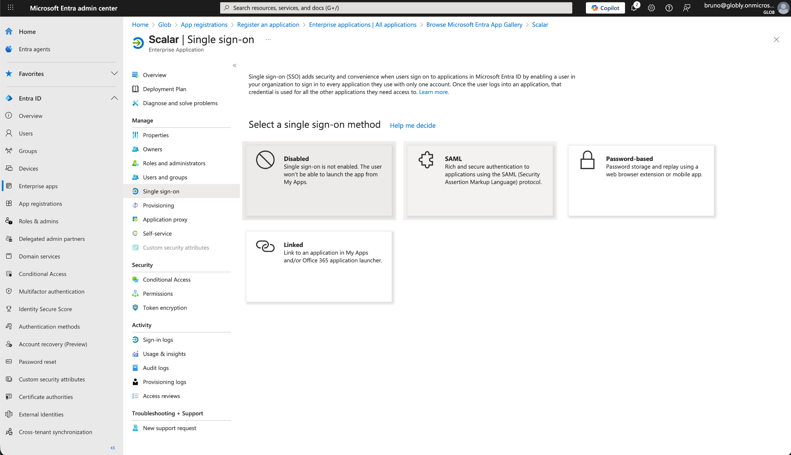
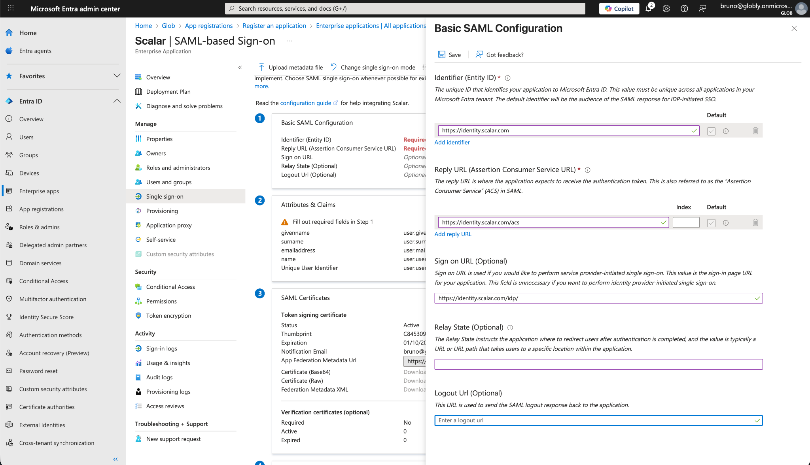
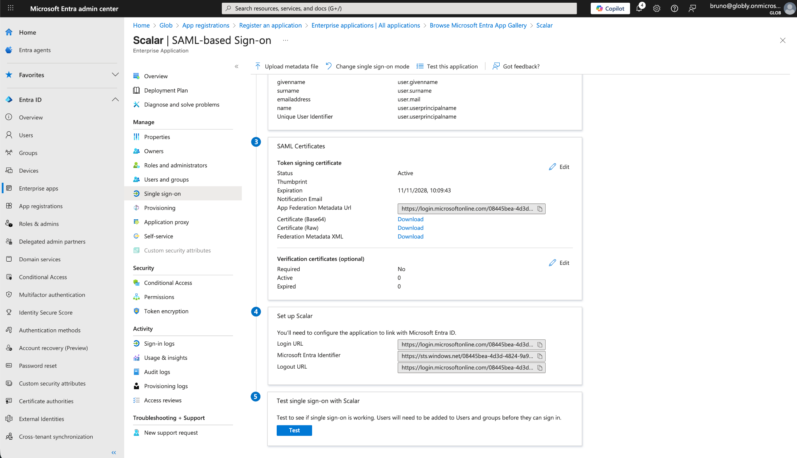
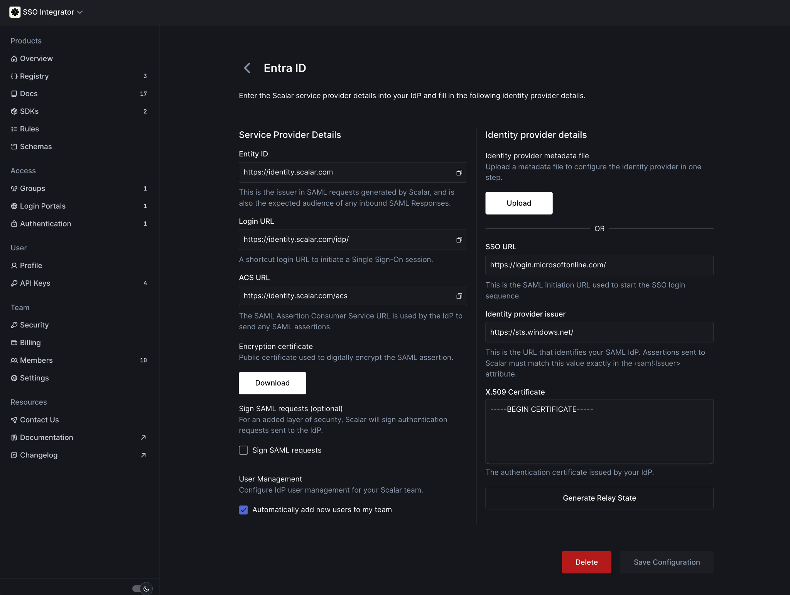
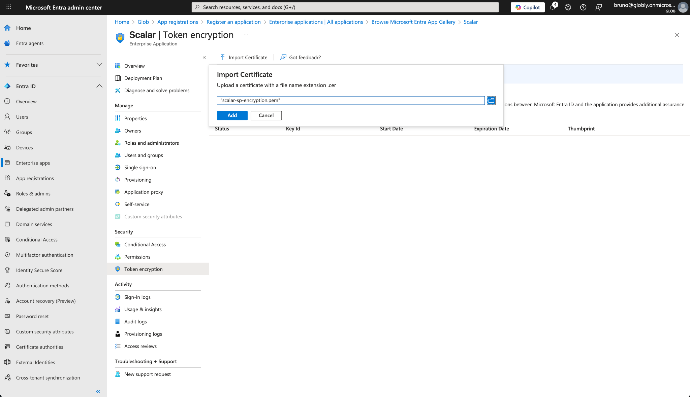
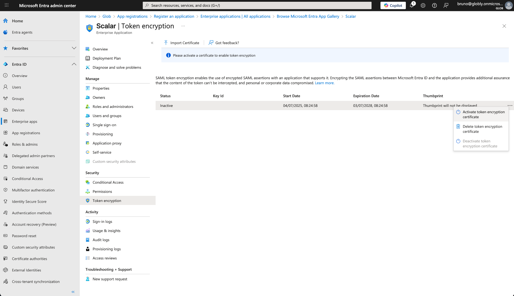
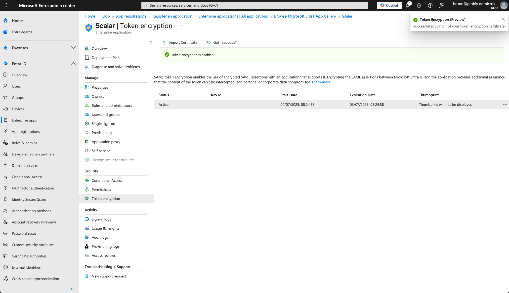

# Microsoft Entra ID (Formerly Azure AD)

Configure SAML-based SSO between Microsoft Entra ID and Scalar.

## Requirements

* SSO/SAML requires a Scalar Enterprise subscription. Read more about [our pricing](../../pricing.md).
* You are the owner or admin of your Scalar team.

## 1. Create a New Enterprise Application

Navigate to **Enterprise applications** in the Microsoft Entra ID sidebar and select **New application**. Choose **Create your own application** and enter a name (e.g., "Scalar"):

### Create Your Own Application

## 2. Assign Users and Groups

After creating the application, assign the users and groups that should have access to Scalar:

### Users and Groups

## 3. Select SAML Authentication

Go to **Single sign-on** and select **SAML** as the authentication method:

### Select Single Sign-On Method

## 4. Create a Connection in Scalar

Before configuring SAML settings, create a new SSO connection in Scalar:

1. Navigate to [Team > Security](https://dashboard.scalar.com/team/security) in Scalar
2. Under **Advanced Security**, enable **Single Sign-On**
3. Click **Setup Connection** to create a new SSO connection

This will provide you with the values needed for the next step.

## 5. Configure Basic SAML Settings

Configure the Basic SAML Configuration with the following service provider details:

### Basic SAML Configuration

| Field                                      | Value                             |
| ------------------------------------------ | --------------------------------- |
| Identifier (Entity ID)                     | `https://identity.scalar.com`     |
| Reply URL (Assertion Consumer Service URL) | `https://identity.scalar.com/acs` |
| Sign on URL (Optional)                     | "Login URL" from Scalar           |
| Relay State (Optional)                     | "Generate Relay State" in Scalar  |

## 6. Copy IdP Details to Scalar

Copy the IdP details from Microsoft Entra ID into Scalar:

| Scalar                     | Microsoft Entra ID       |
| -------------------------- | ------------------------ |
| Login URL                  | SSO URL                  |
| Microsoft Entra Identifier | Identity Provider Issuer |
| Certificate (Base64)       | X.509 Certificate        |

### SAML Certificates

### Service Provider Details

## 7. Enable Token Encryption

Scalar requires token encryption for SAML assertions. Download the encryption certificate from the Scalar and import it into Microsoft Entra ID under **Token encryption**:

### Import the Encryption Certificate

### Configure Token Encryption

### Verify Token Encryption is Enabled

## Done!

Your organization is now ready to use Scalar SSO with Microsoft Entra ID! If you run into any issues, double-check your settings - or just [reach out to our support team](mailto:support@scalar.com), we're here to help!
