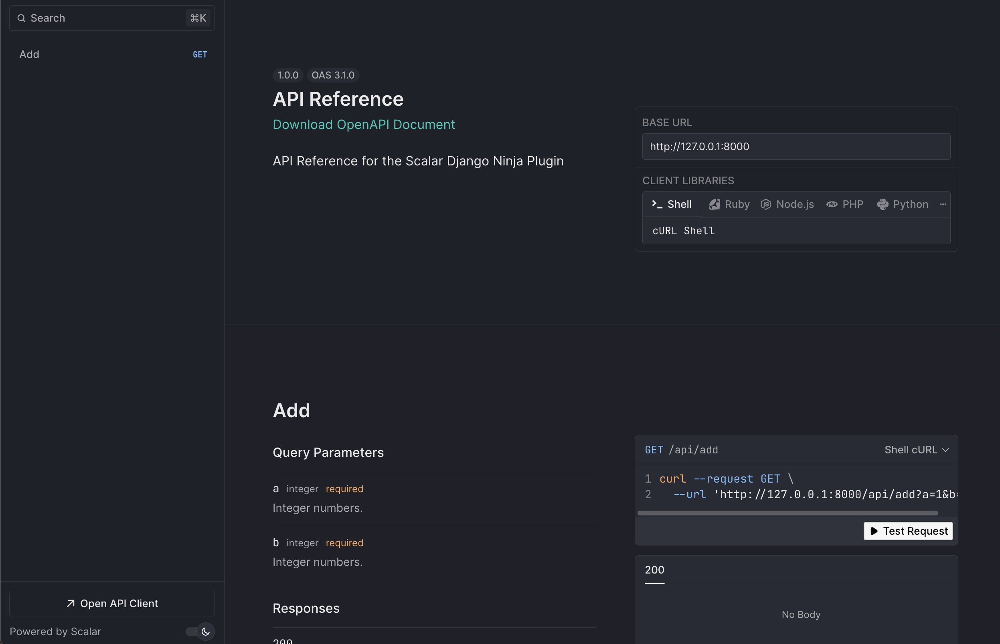

# Scalar API Reference for Django Ninja

The easiest way to render a modern and beautiful API reference based on your Django Ninja OpenAPI document.



## Installation

```bash
pip install scalar-ninja
```

## Usage

Integrating Scalar with Django Ninja is simple.

### Basic Usage

Just pass the `ScalarViewer` instance to the `docs` parameter of the NinjaAPI instance.

```python
from ninja import NinjaAPI
from scalar_ninja import ScalarViewer

api = NinjaAPI(
    version="1.0.0",
    title="API Reference",
    description="API Reference for the Scalar Django Ninja Plugin",
    docs=ScalarViewer(),
)

@api.get("/add")
def add(request, a: int, b: int):
    return {"result": a + b}


urlpatterns = [
    path("admin/", admin.site.urls),
    path("api/", api.urls),
]
```

This renders a beautiful API reference at `/api/docs` based on your API.

### Advanced Usage

You can configure `ScalarViewer` by passing `ScalarConfig` to the method. Detailed configuration options are listed [here](#configuration).

```python
from ninja import NinjaAPI
from scalar_ninja import ScalarConfig, ScalarViewer

scalar_config = ScalarConfig(
    show_sidebar=False,
    force_dark_mode_state="dark",
)

api = NinjaAPI(
    version="1.0.0",
    title="API Reference",
    description="API Reference for the Scalar Django Ninja Plugin",
    docs=ScalarViewer(scalar_config),
)
```

For backwards compatibility you can also add the available configuration options as `kwargs` to `ScalarViewer`:

```python
from ninja import NinjaAPI
from scalar_ninja import ScalarViewer

api = NinjaAPI(
    version="1.0.0",
    title="API Reference",
    description="API Reference for the Scalar Django Ninja Plugin",
    docs=ScalarViewer(show_sidebar=False, force_dark_mode_state="dark"),
    docs_url="/docs/",
)
```

It's recommend to use `ScalarConfig` to have a fully typed configuration.

## Configuration

Currently available [configuration options](../configuration.md) are listed below.

### Core Configuration

- `openapi_url` (default `None`) - The OpenAPI URL that Scalar should load and use. This is normally done automatically by FastAPI using the default URL `/api/openapi.json`. If `content` or `sources` are provided, this parameter is ignored.
- `content` (default `None`) - Directly pass an OpenAPI/Swagger document as a string (JSON or YAML) or as a dictionary. If `sources` are provided, this parameter is ignored.
- `sources` (default `None`) - Add multiple OpenAPI documents to render all of them. Each source can have a title, slug, url, content, and default flag.
- `title` (default `"Scalar"`) - The title of the API reference page

### OpenAPISource Configuration

When using multiple sources, each `OpenAPISource` can be configured with:

- `title` (default `None`) - Display name for the API. If not provided, will fallback to 'API #1', 'API #2', etc.
- `slug` (default `None`) - URL identifier for the API. If not provided, will be auto-generated from the title or index.
- `url` (default `None`) - URL to the OpenAPI document (JSON or YAML). Mutually exclusive with content.
- `content` (default `None`) - Direct OpenAPI content as string (JSON/YAML) or dictionary. Mutually exclusive with url.
- `default` (default `False`) - Whether this source should be the default when multiple sources are provided.

### Display Options

- `layout` (default `Layout.MODERN`) - Options: [Layout](#Layout)
- `show_sidebar` (default `True`)
- `hide_models` (default `False`)
- `hide_search` (default `False`) - Whether to show the sidebar search bar
- `hide_test_request_button` (default `False`) - Whether to show the "Test Request" button
- `hide_download_button` (default `False`) - **Deprecated**: Use `document_download_type` instead
- `document_download_type` (default `DocumentDownloadType.BOTH`) - Sets the file type of the document to download. Options: [DocumentDownloadType](#DocumentDownloadType)

### Theme and Appearance

- `dark_mode` (default `True`)
- `force_dark_mode_state` (default `None`) - Force dark mode state to always be this state. Can be 'dark' or 'light'
- `hide_dark_mode_toggle` (default `False`) - Whether to show the dark mode toggle
- `with_default_fonts` (default `True`) - Whether to use default fonts (Inter and JetBrains Mono)
- `custom_css` (default `""`) - Custom CSS string to apply to the API reference

### Search and Navigation

- `search_hot_key` (default `SearchHotKey.K`) - Options: [SearchHotKey](#SearchHotKey)
- `default_open_all_tags` (default `False`)
- `expand_all_model_sections` (default `False`) - Whether to expand all model sections by default
- `expand_all_responses` (default `False`) - Whether to expand all response sections by default
- `order_required_properties_first` (default `True`) - Whether to order required properties first in schema objects

### Server Configuration

- `base_server_url` (default `""`) - If you want to prefix all relative servers with a base URL
- `servers` (default `[]`)
- `hidden_clients` (default `[]`)

### Authentication

- `authentication` (default `{}`)
- `hide_client_button` (default `False`) - Whether to show the client button from the reference sidebar and modal
- `persist_auth` (default `False`) - Whether to persist authentication credentials in local storage

### Advanced

- `scalar_js_url` (default `"https://cdn.jsdelivr.net/npm/@scalar/api-reference"`)
- `scalar_proxy_url` (default `None`)
- `scalar_favicon_url` (default `"https://django-ninja.dev/img/favicon.png"`)
- `integration` (default `None`)
- `theme` (default `Theme.DEFAULT`) - Options: [Theme](#Theme)

### DocumentDownloadType

```python
from scalar_ninja import DocumentDownloadType

# Available options:
DocumentDownloadType.JSON    # Download as JSON only
DocumentDownloadType.YAML    # Download as YAML only
DocumentDownloadType.BOTH    # Download as both JSON and YAML
DocumentDownloadType.NONE    # Hide download button
```

### Layout

```python
from scalar_ninja import Layout

# Available options:
Layout.MODERN    # Modern layout
Layout.CLASSIC   # Classic layout
```

### SearchHotKey

```python
from scalar_ninja import SearchHotKey

# All letters from A to Z, e.g.:
SearchHotKey.K   # Use 'K' key for 'Cmd+K' (Mac) / 'Ctrl+K' (Windows/Linux)
```

### Theme

```python
from scalar_ninja import Theme

# Available options:
Theme.DEFAULT   # Default theme
Theme.NONE      # No theme
