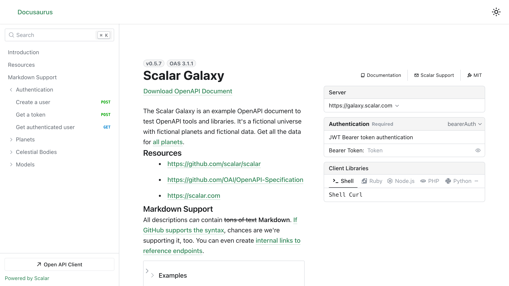

# Scalar API Reference for Docusaurus

Docusaurus helps you to ship a beautiful documentation site in no time. For everyone who wants to make their API reference part of a Docusaurus website, we've built a Scalar API Reference plugin.



## Installation

```bash
npm install @scalar/docusaurus
```

## Usage

Simply add to the plugins section of your Docusaurus config. If you are using Typescript you can import the type options type as well.

```typescript
import type { ScalarOptions } from '@scalar/docusaurus'

plugins: [
  [
    '@scalar/docusaurus',
    {
      label: 'Scalar',
      route: '/scalar',
      showNavLink: true, // optional, default is true
      configuration: {
        url: 'https://registry.scalar.com/@scalar/apis/galaxy?format=yaml',
      },
    } as ScalarOptions,
  ],
],
```

### Multiple API references

Is it possible to show multiple API references? Yes, it is! :)

You can either display each API reference in its own page, or display multiple API references on a single page.

#### Create a page for each API reference

```typescript
import type { ScalarOptions } from '@scalar/docusaurus'

plugins: [
  // First API definition
  [
    '@scalar/docusaurus',
    {
      // the `id` is required if you have multiple instances of the @scalar/docusaurus plugin
      id: 'scalar/galaxy',
      label: 'Scalar',
      route: '/scalar',
      showNavLink: true, // optional, default is true
      configuration: {
        url: 'https://registry.scalar.com/@scalar/apis/galaxy?format=json',
      },
    } as ScalarOptions,
  ],
  // Second API definition
  [
    '@scalar/docusaurus',
    {
      // the `id` is required if you have multiple instances of the @scalar/docusaurus plugin
      id: 'petstore',
      label: 'Petstore',
      route: '/petstore',
      showNavLink: true, // optional, default is true
      configuration: {
        url: 'https://petstore3.swagger.io/api/v3/openapi.json',
      },
    } as ScalarOptions,
  ],
],
```

#### Create a page that contains multiple API references

```typescript
import type { ScalarOptions } from '@scalar/docusaurus'
plugins: [
  [
    '@scalar/docusaurus',
    {
      id: 'api-reference',
      label: 'API Reference',
      route: '/api-reference',
      showNavLink: true, // optional, default is true
      configuration: {
        sources: [
          {
            // This title will appear in the top left corner of your new API reference page.
            title: 'Scalar Galaxy API',
            url: 'https://registry.scalar.com/@scalar/apis/galaxy?format=json',
          },
          {
            title: 'Petstore',
            url: 'https://petstore3.swagger.io/api/v3/openapi.json',
          },
        ],
      },
    } as ScalarOptions,
  ],
],
```

### Example

You can find an example in this repo under [integrations/docusaurus/playground](https://github.com/scalar/scalar/tree/main/integrations/docusaurus/playground)

Run the example using

```bash
npm run playground
```

## Config

These configuration options are a WIP as this plugin is still in beta

### label: string

The label on the nav bar for this route

### route: string

Path at which the API Reference will be shown

### configuration: ReferenceProps

You can find the full configuration options under
[packages/api-reference](https://github.com/scalar/scalar/tree/main/packages/api-reference)
minus theme.

## Guide

### Create a new Docusaurus project (optional)

If you're starting fresh, let's install Docusaurus first:

> Note: It seems there are some issues with Docusaurus and npm. We'd recommend to [use pnpm](https://pnpm.io/installation), which is an awesome alternative to npm.

```bash
pnpm create create-docusaurus@latest my-awesome-website classic
```

If the installer asks you which language you prefer, pick whatever feels right. If you don't know what TypeScript is, use JavaScript. Both options will work great:

```plaintext
? Which language do you want to use?
❯   JavaScript
    TypeScript
```

You've got your project ready. Time to start the development server:

```bash
cd my-awesome-website
pnpm start
```

Boom, that's it. Open <http://localhost:3000/> to see the Docusaurus example documentation.

### Render your OpenAPI reference with Scalar

Okay, you're ready to render your API reference with Docusaurus?

First, install our plugin:

> Note: It seems there are some issues with Docusaurus and npm. We'd recommend to [use pnpm](https://pnpm.io/installation), which is an awesome alternative to npm.
>
> Otherwise you'll probably receive something like:
>
> npm ERR! Cannot read properties of null (reading 'matches')

```bash
pnpm add @scalar/docusaurus
```

There's just one more step required: Adding the plugin to your Docusaurus configuration.

```typescript
// docusaurus.config.js

// …

const config = {
  // …
  plugins: [
    [
      '@scalar/docusaurus',
      {
        label: 'Scalar',
        route: '/scalar',
        configuration: {
          // Put the URL to your OpenAPI document here:
          url: 'https://registry.scalar.com/@scalar/apis/galaxy?format=json',
        },
      },
    ],
  ],
}
```

That's it, you made it! This should render our Scalar Galaxy example on <http://localhost:3000/scalar> if you used the OpenAPI url shown above, or your own APIs if you supplied your own.

### Alternative: Docusaurus Configuration in TypeScript

Hey, big TypeScript fans here. If you're one, too, here's the Docusaurus configuration in TypeScript:

```typescript
// docusaurus.config.ts
import type { Config } from '@docusaurus/types'
import type { ScalarOptions } from '@scalar/docusaurus'

// …

const config: Config = {
  // …
  plugins: [
    [
      '@scalar/docusaurus',
      {
        label: 'Scalar',
        route: '/scalar',
        configuration: {
          // Put the URL to your OpenAPI document here:
          url: 'https://registry.scalar.com/@scalar/apis/galaxy?format=json',
        },
      } as ScalarOptions,
    ],
  ],
}
```
