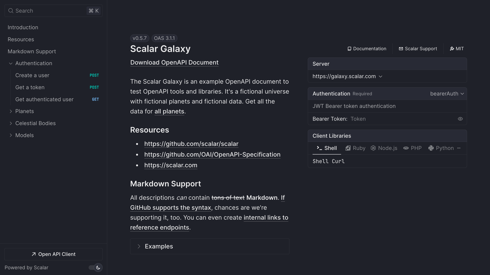

# Scalar API Reference Plugin for FastAPI



## Installation

```bash
pip install scalar-fastapi
```

## Usage

FastAPI makes it super easy to enable scalar with their out of the box OpenAPI support

```python
from fastapi import FastAPI
from scalar_fastapi import get_scalar_api_reference

app = FastAPI()

@app.get("/")
def read_root():
    return {"Hello": "World"}

@app.get("/scalar", include_in_schema=False)
async def scalar_html():
    return get_scalar_api_reference(
        openapi_url=app.openapi_url,
        title=app.title,
    )
```

## Configuration

Currently available [configuration options](https://github.com/scalar/scalar/blob/main/documentation/configuration.md) are listed below.

- `layout` (default `Layout.MODERN`)
- `show_sidebar` (defualt `true`)
- `hide_download_button` (default `false`)
- `hide_models` (default `false`)
- `dark_mode` (default `true`)
- `search_hot_key` (default `SearchHotKey.K`)
- `hidden_clients` (default `[]`)
- `servers` (default `[]`)
- `default_open_all_tags` (default `false`)
- `authentication` (default `{}`)
- `hide_client_button`(default `false`)

## Example

Check out the [playground](./playground/README.md) for a working example.
