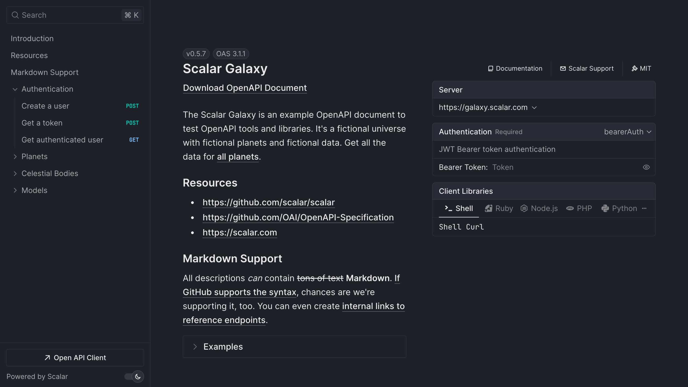

# API Reference Plugin for FastAPI



## Installation

```bash
pip install scalar-fastapi
```

## Usage

FastAPI makes it super easy to enable Scalar with their out of the box OpenAPI support.

### Quickstart

The fastest way to add Scalar is a single call. `add_scalar_reference` registers the route for you and reads the title and OpenAPI URL from your app:

```python
from fastapi import FastAPI
from scalar_fastapi import add_scalar_reference

app = FastAPI()

add_scalar_reference(app)
```

Now open `/scalar` in your browser.

You can change the route and pass through any option that `get_scalar_api_reference` accepts:

```python
from scalar_fastapi import add_scalar_reference, Theme

add_scalar_reference(app, route="/docs/scalar", theme=Theme.KEPLER)
```

`add_scalar_reference` accepts `route` (default `/scalar`) and `include_in_schema` (default `False`); every other keyword argument is forwarded to `get_scalar_api_reference`.

### Custom route

If you want full control over the route, add it yourself with `get_scalar_api_reference`:

```python
from fastapi import FastAPI
from scalar_fastapi import get_scalar_api_reference

app = FastAPI()

@app.get("/scalar", include_in_schema=False)
async def scalar_html():
    return get_scalar_api_reference(
        # Your OpenAPI document
        openapi_url=app.openapi_url,
        # Avoid CORS issues (optional)
        scalar_proxy_url="https://proxy.scalar.com",
    )
```

### Multiple OpenAPI Sources

You can now display multiple OpenAPI documents in a single Scalar instance:

```python
from scalar_fastapi import get_scalar_api_reference, OpenAPISource

@app.get("/scalar", include_in_schema=False)
async def scalar_html():
    return get_scalar_api_reference(
        sources=[
            OpenAPISource(
                title="User API",
                url="/openapi.json",
                default=True
            ),
            OpenAPISource(
                title="Admin API",
                url="/admin/openapi.json"
            ),
            OpenAPISource(
                title="External API",
                content='{"openapi": "3.0.0", ...}'
            )
        ],
        title="My API Documentation"
    )
```

### Direct OpenAPI Content

You can pass OpenAPI content directly as a string or dictionary:

```python
@app.get("/scalar", include_in_schema=False)
async def scalar_html():
    return get_scalar_api_reference(
        content='{"openapi": "3.0.0", "info": {"title": "My API"}}',
        title="My API"
    )
```

### Agent

Agent adds an AI chat interface to your API reference. It is enabled by default on localhost (with limited free messages). For production you need an [Agent key](../guides/agent/key.md). See the [Agent configuration section](../configuration.md#agent) for details.

**Per-source: enable Agent with a key**

```python
from scalar_fastapi import get_scalar_api_reference, OpenAPISource, AgentScalarConfig

@app.get("/scalar", include_in_schema=False)
async def scalar_html():
    return get_scalar_api_reference(
        sources=[
            OpenAPISource(
                title="User API",
                url="/openapi.json",
                default=True,
                agent=AgentScalarConfig(key="your-agent-scalar-key"),
            ),
        ],
        title="My API Documentation"
    )
```

**Disable Agent entirely**

```python
from scalar_fastapi import get_scalar_api_reference, AgentScalarConfig

@app.get("/scalar", include_in_schema=False)
async def scalar_html():
    return get_scalar_api_reference(
        openapi_url="/openapi.json",
        agent=AgentScalarConfig(disabled=True),
    )
```

## Configuration

Currently available [configuration options](../configuration.md) are listed below.

### Core Configuration

- `openapi_url` (default `None`) - The OpenAPI URL that Scalar should load. If `content` or `sources` are provided, this parameter is ignored.
- `content` (default `None`) - Directly pass an OpenAPI/Swagger document as a string (JSON or YAML) or as a dictionary. If `sources` are provided, this parameter is ignored.
- `sources` (default `None`) - Add multiple OpenAPI documents to render all of them. Each source can have a title, slug, url, content, and default flag.
- `title` (default `"Scalar"`) - The title of the API reference page

### OpenAPISource Configuration

When using multiple sources, each `OpenAPISource` can be configured with:

- `title` (default `None`) - Display name for the API. If not provided, will fallback to 'API #1', 'API #2', etc.
- `slug` (default `None`) - URL identifier for the API. If not provided, will be auto-generated from the title or index.
- `url` (default `None`) - URL to the OpenAPI document (JSON or YAML). Mutually exclusive with content.
- `content` (default `None`) - Direct OpenAPI content as string (JSON/YAML) or dictionary. Mutually exclusive with url.
- `default` (default `False`) - Whether this source should be the default when multiple sources are provided.
- `agent` (default `None`) - Optional Agent config for this source (`key`, `disabled`). See [Agent](../configuration.md#agent) for details.

### Display Options

- `layout` (default `Layout.MODERN`)
- `show_sidebar` (default `True`)
- `hide_models` (default `False`)
- `hide_search` (default `False`) - Whether to show the sidebar search bar
- `hide_test_request_button` (default `False`) - Whether to show the "Test Request" button
- `hide_download_button` (default `False`) - **Deprecated**: Use `document_download_type` instead
- `document_download_type` (default `DocumentDownloadType.BOTH`) - Sets the file type of the document to download. Options: `JSON`, `YAML`, `BOTH`, `NONE`
- `show_developer_tools` (default `"localhost"`) - Configures when to show the top developer tools panel. Options: `"always"`, "`localhost"`, `"never"`

### DocumentDownloadType

```python
from scalar_fastapi import DocumentDownloadType

# Available options:
DocumentDownloadType.JSON    # Download as JSON only
DocumentDownloadType.YAML    # Download as YAML only
DocumentDownloadType.BOTH    # Download as both JSON and YAML
DocumentDownloadType.NONE    # Hide download button
```

### Theme and Appearance

- `dark_mode` (default `None`) - Whether dark mode is on or off initially. When left unset, the reader's preference is used
- `force_dark_mode_state` (default `None`) - Force dark mode state to always be this state. Can be 'dark' or 'light'
- `hide_dark_mode_toggle` (default `False`) - Whether to show the dark mode toggle
- `with_default_fonts` (default `True`) - Whether to use default fonts (Inter and JetBrains Mono)
- `custom_css` (default `""`) - Custom CSS string to apply to the API reference

### Search and Navigation

- `search_hot_key` (default `SearchHotKey.K`)
- `default_open_all_tags` (default `False`)
- `expand_all_model_sections` (default `False`) - Whether to expand all model sections by default
- `expand_all_responses` (default `False`) - Whether to expand all response sections by default
- `order_required_properties_first` (default `True`) - Whether to order required properties first in schema objects
- `order_schema_properties_by` (default `"alpha"`) - Sets schema property ordering. Options: `"alpha"`, `"preserve"`

### Server Configuration

- `base_server_url` (default `""`) - If you want to prefix all relative servers with a base URL
- `servers` (default `[]`) - List of OpenAPI Server Objects. Each item must have a required `url` (string) and may have optional `description` (string) and `variables` (map). Example: `[{"url": "https://api.example.com", "description": "Production"}]`
- `hidden_clients` (default `[]`)

### Authentication

- `authentication` (default `{}`)
- `hide_client_button` (default `False`) - Whether to show the client button from the reference sidebar and modal
- `persist_auth` (default `False`) - Whether to persist authentication credentials in local storage

### Advanced

- `scalar_js_url` (default `"https://cdn.jsdelivr.net/npm/@scalar/api-reference"`)
- `scalar_proxy_url` (default `""`)
- `integration` (default `"fastapi"`) - Set to `None` to omit the integration marker
- `theme` (default `Theme.DEFAULT`)
- `agent` (default `None`) - Set to `AgentScalarConfig(disabled=True)` to disable Agent entirely, or use per-source `agent` on `OpenAPISource` for keys. See [Agent](../configuration.md#agent).
- `overrides` (default `{}`) - Specific overrides directly to the `config` dictionary which is passed as `Scalar.createApiReference("#app", {json.dumps(config)})`
- `telemetry` (default `True`) - Enable or disable api client usage telemetry. Options: `True`, `False`

### Layout

```python
from scalar_fastapi import Layout

# Available options:
Layout.MODERN    # Modern layout
Layout.CLASSIC   # Classic layout
```

### SearchHotKey

`SearchHotKey` has one member per letter, `SearchHotKey.A` through `SearchHotKey.Z`. The chosen key is combined with the platform modifier (Cmd on macOS, Ctrl elsewhere). The default is `SearchHotKey.K`.

```python
from scalar_fastapi import SearchHotKey

get_scalar_api_reference(
    openapi_url="/openapi.json",
    search_hot_key=SearchHotKey.S,  # Cmd/Ctrl + S
)
```

### Theme

```python
from scalar_fastapi import Theme

# Available options (default is Theme.DEFAULT):
Theme.DEFAULT
Theme.ALTERNATE
Theme.MOON
Theme.PURPLE
Theme.SOLARIZED
Theme.BLUE_PLANET
Theme.SATURN
Theme.KEPLER
Theme.MARS
Theme.DEEP_SPACE
Theme.LASERWAVE
Theme.NONE  # Render without a Scalar theme
```
