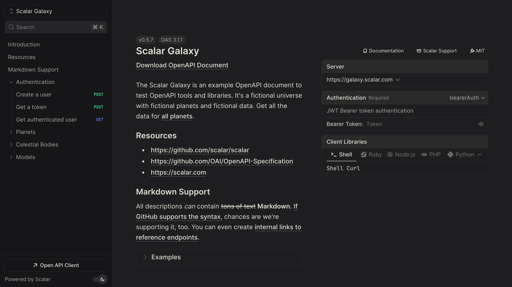

# API Reference for Hono

This middleware provides an easy way to render a beautiful API reference based on an OpenAPI/Swagger document with Hono.



## Installation

```bash
npm install @scalar/hono-api-reference
```

## Usage

Set up [Zod OpenAPI Hono](https://github.com/honojs/middleware/tree/main/packages/zod-openapi) or [Hono OpenAPI](https://github.com/rhinobase/hono-openapi) and pass the configured URL to the `Scalar` middleware:

```typescript
import { Hono } from 'hono'
import { Scalar } from '@scalar/hono-api-reference'

const app = new Hono()

// Use the middleware to serve the API Reference at /scalar
app.get('/scalar', Scalar({ url: '/doc' }))

// Or with dynamic configuration
app.get('/scalar', Scalar((c) => {
  return {
    url: '/doc',
    proxyUrl: c.env.ENVIRONMENT === 'development' ? 'https://proxy.scalar.com' : undefined,
  }
}))

export default app
```

The Hono middleware takes our universal configuration object, [read more about configuration](../configuration.md) in the core package README.

### Themes

The middleware comes with a custom theme for Hono. You can use one of [the other predefined themes](https://github.com/scalar/scalar/blob/main/packages/themes/src/index.ts#L15) (`alternate`, `default`, `moon`, `purple`, `solarized`) or overwrite it with `none`. All themes come with a light and dark color scheme.

```typescript
import { Scalar } from '@scalar/hono-api-reference'

// Switch the theme (or pass other options)
app.get('/scalar', Scalar({
  url: '/doc',
  theme: 'purple',
}))
```

### Custom page title

There's one additional option to set the page title:

```typescript
import { Scalar } from '@scalar/hono-api-reference'

// Set a page title
app.get('/scalar', Scalar({
  url: '/doc',
  pageTitle: 'Awesome API',
}))
```

### Custom CDN

You can use a custom CDN, default is `https://cdn.jsdelivr.net/npm/@scalar/api-reference`.

You can also pin the CDN to a specific version by specifying it in the CDN string like `https://cdn.jsdelivr.net/npm/@scalar/api-reference@1.25.28`

You can find all available CDN versions [here](https://www.jsdelivr.com/package/npm/@scalar/api-reference?tab=files)

```typescript
import { Scalar } from '@scalar/hono-api-reference'

app.get('/scalar', Scalar({ url: '/doc', pageTitle: 'Awesome API' }))

app.get('/scalar', Scalar({
  url: '/doc',
  cdn: 'https://cdn.jsdelivr.net/npm/@scalar/api-reference@latest',
}))
```

### Markdown for LLMs

If you want to create a Markdown version of the API reference (for LLMs), install `@scalar/openapi-to-markdown`:

```bash
npm install @scalar/openapi-to-markdown
```

And add an additional route for it:

```typescript
import { Hono } from 'hono'
import { createMarkdownFromOpenApi } from '@scalar/openapi-to-markdown'

const app = new Hono()

// Generate Markdown from your OpenAPI document
const markdown = await createMarkdownFromOpenApi(content)

/**
 * Register a route to serve the Markdown for LLMs
 *
 * Q: Why /llms.txt?
 * A: It's a proposal to standardise on using an /llms.txt file.
 *
 * @see https://llmstxt.org/
 */
app.get('/llms.txt', (c) => c.text(markdown))

export default app
```

Or, if you are using Zod OpenAPI Hono:

```typescript
// Get the OpenAPI document
const content = app.getOpenAPI31Document({
  openapi: '3.1.0',
  info: { title: 'Example', version: 'v1' },
})

const markdown = await createMarkdownFromOpenApi(JSON.stringify(content))

app.get('/llms.txt', async (c) => {
  return c.text(markdown)
})
```

### Publish to the Scalar Registry

If you generate your OpenAPI document from Zod OpenAPI Hono, you can publish it to the [Scalar Registry](../guides/registry/getting-started.md) to power hosted docs, share it with your team, and keep versions in sync. You do not need a running server for this — `OpenAPIHono` can build the document straight from your Zod-driven routes.

Add a small script that calls `getOpenAPI31Document()` and writes the result to a file:

```typescript
// scripts/generate-openapi.ts
import { writeFileSync } from 'node:fs'
import { app } from '../src/app'

const document = app.getOpenAPI31Document({
  openapi: '3.1.0',
  info: {
    title: 'Example API',
    version: '0.1.0',
  },
  servers: [{ url: process.env.BASE_URL ?? 'https://example.com' }],
})

writeFileSync('openapi.json', `${JSON.stringify(document, null, 2)}\n`)
```

Here `app` is your `OpenAPIHono` instance with all routes registered. This is the same document you would serve at runtime with `app.doc31('/openapi.json', ...)`, just written to a file instead.

Wire it up with a couple of scripts. The [Scalar CLI](https://github.com/scalar/scalar/tree/main/packages/cli) handles validation and publishing:

```json
{
  "scripts": {
    "openapi:generate": "tsx scripts/generate-openapi.ts openapi.json",
    "scalar:publish": "pnpm openapi:generate && scalar registry publish openapi.json --namespace your-namespace --slug your-api"
  }
}
```

To keep the registry up to date automatically, run the same steps in CI whenever a route or schema changes:

```yaml
# .github/workflows/scalar.yml
name: Publish API docs

on:
  push:
    branches: [main]
    # Only republish when something that can change the document changes
    paths:
      - 'src/**'
      - 'scripts/generate-openapi.ts'
  workflow_dispatch: {}

jobs:
  publish:
    runs-on: ubuntu-latest
    steps:
      - uses: actions/checkout@v4
      - uses: pnpm/action-setup@v4
      - uses: actions/setup-node@v4
        with:
          # @scalar/cli requires Node >= 24
          node-version: 24
          cache: pnpm

      - name: Install
        run: pnpm install --frozen-lockfile

      - name: Generate OpenAPI document
        run: pnpm openapi:generate

      - name: Validate document
        run: pnpm dlx @scalar/cli document validate openapi.json

      - name: Publish to Scalar Registry
        env:
          SCALAR_API_KEY: ${{ secrets.SCALAR_API_KEY }}
        run: |
          pnpm dlx @scalar/cli auth login --token "$SCALAR_API_KEY"
          # Publish under the document's own info.version so a docs route can
          # pin a stable version. --force overwrites that version on every push.
          VERSION="$(node -p "require('./openapi.json').info.version")"
          pnpm dlx @scalar/cli registry publish openapi.json \
            --namespace your-namespace --slug your-api \
            --version "$VERSION" --force
```
