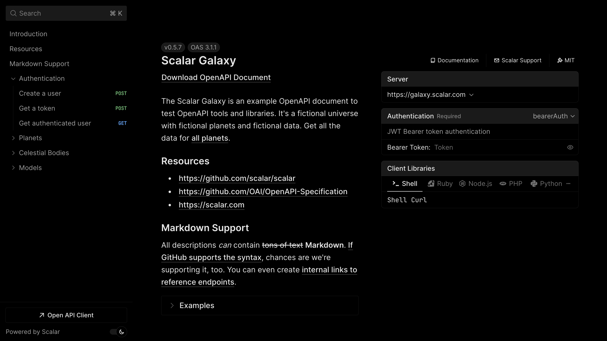

# Scalar for SvelteKit

A SvelteKit integration for the Scalar API Reference



## Installation

```bash
npm install @scalar/sveltekit
```

## Usage

```typescript
// routes/+server.ts
import { ScalarApiReference } from '@scalar/sveltekit'
import type { RequestHandler } from './$types'

const render = ScalarApiReference({
  url: 'https://registry.scalar.com/@scalar/apis/galaxy?format=json',
})

export const GET: RequestHandler = () => {
  return render()
}
```
