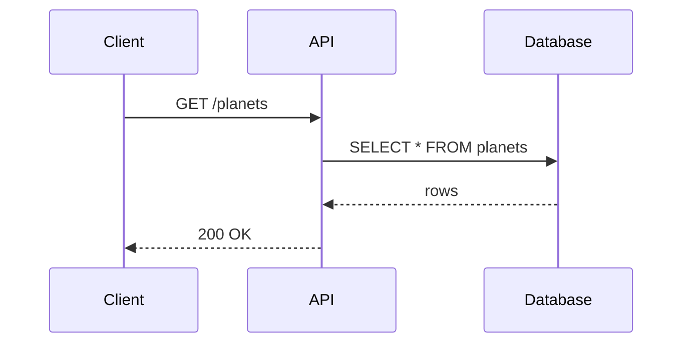

# Markdown

You can use Markdown in various places, for example in `info.description`, in your tag descriptions, in your operation
descriptions, in your parameter descriptions and in a lot of other places. We're using GitHub-flavored Markdown.
What's working here, is probably also working in the API reference:

- bullet lists, numbered lists
- _italic_, **bold**, ~~striked~~ text
- accordions
- links
- tables
- images
- alerts
- diagrams (with Mermaid)
- …

## Alerts

You can use markdown alerts in your descriptions.

```markdown
> [!tip]
> You can now use markdown alerts in your descriptions.
```

The following alert types are supported:

- `note`
- `tip`
- `important`
- `warning`
- `caution`
- `success`

[Have a look at our OpenAPI example](https://github.com/scalar/scalar/blob/main/packages/galaxy/src/documents/3.1.yaml)
to see more examples.

## Mermaid diagrams

You can embed [Mermaid](https://mermaid.js.org/) diagrams by using a fenced code block with the `mermaid` language.
They are rendered as diagrams in the API reference and follow the active light or dark color mode.

````markdown

````

> Note: Not everything is supported in all places. For example, you can use images in most places, but not in parameter
> descriptions.
