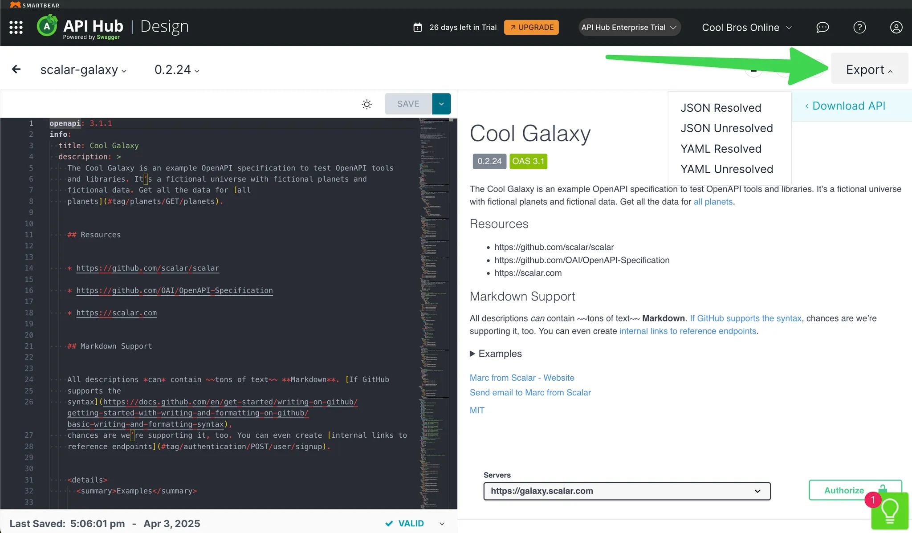
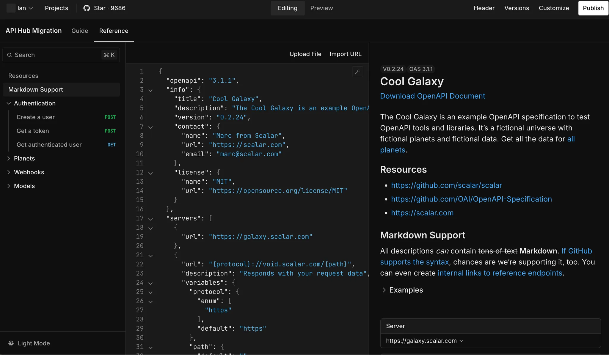
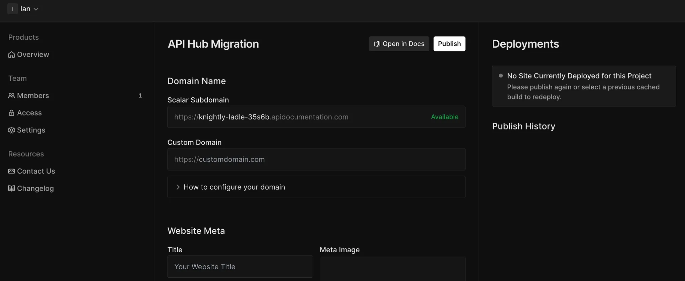
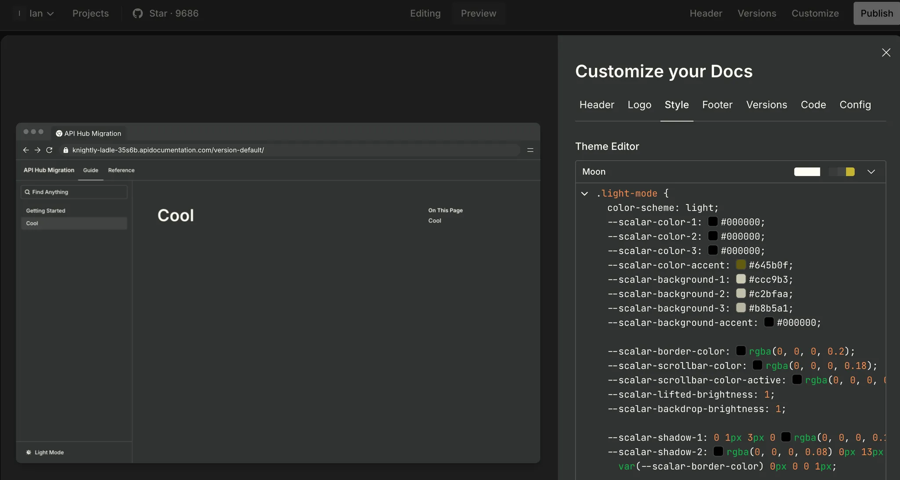
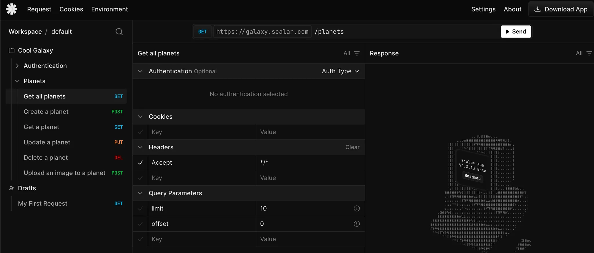

# How to migrate from Smartbear API Hub (ex. SwaggerHub) to Scalar

[Scalar](https://scalar.com/) is a drop-in replacement for API Hub's Design, Portal, and Explore features, also known as “SmartBear SwaggerHub, SwaggerHub Portal, and SwaggerHub Explore” (a bit of a mouthful).

Scalar includes many of the same features as API Hub including:

1. A centralized location to edit and collaborate on OpenAPI and Swagger documents.
2. An interactive, customizable, and publishable API reference builder.
3. Custom domains, theming, and logos.
4. A built-in, local-first API client to help developers and end users call endpoints and test  APIs.

Beyond having a simpler name, Scalar is also [free to use forever](../guides/pricing.md) with fewer limits than API Hub. If you want custom domains, GitHub sync, and a few other features, our Pro plan is only $24/m.

As a bonus, Scalar is also open source, meaning you can self-host it and view all of its code on [GitHub](https://github.com/scalar/scalar).

## How to migrate from API Hub Design to Scalar

Migrating is as simple as exporting your API doc from API Hub Design and uploading it to Scalar.

To start, go into API Hub Design and find the API you want to export. On the editor page, click **Export** in the top right and choose **JSON Unresolved**  to keep `$ref` values to other docs or **JSON Resolved** to include everything inline.



With this exported JSON file, you can [sign up for Scalar](https://dashboard.scalar.com/register), create a new docs project, click the **References** tab of the newly created project, click **Upload File**, and select the JSON file you exported from API Hub. This adds your OpenAPI doc to Scalar, ready to be edited, previewed, and published.



## How to migrate from API Hub Portal to Scalar

API Hub Portal enables you to publish an interactive version of your OpenAPI doc along with markdown guides.

In Scalar, you don't need to go to another product to do this, just click the **Publish** button in the top right of your docs project. This brings you to a page where you can set your domain name, metadata, and more. Once ready, click **Publish** once more to deploy your site.



Adding guides is just as simple. In your Scalar docs project, click the **Guides** tab. There you can add and edit pages. The editor supports markdown, so you can simply copy and paste docs from your API Hub Portal project.

Just like API Hub Portal this is completely customizable. Just click the **Customize** button to edit your header, logo, style, footer, version, code, and config.



### (Optional) Using GitHub Sync with scalar.config.json

If you prefer to manage your documentation via Git (similar to how API Hub Portal can work with version control), you can use Scalar's GitHub Sync feature. This allows you to keep your OpenAPI documents and Markdown guides in a Git repository and automatically publish when changes are merged.

To set this up, create a `scalar.config.json` file in your repository root:

```json
{
  "$schema": "https://cdn.scalar.com/schema/scalar-config-next.json",
  "scalar": "2.0.0",
  "publishOnMerge": true,
  "siteConfig": {
    "subdomain": "name-of-your-api"
  },
  "navigation": {
    "routes": {
      "/": {
        "type": "group",
        "title": "Your API",
        "children": {
          "/guides": {
            "type": "group",
            "title": "Guides",
            "children": {
              "getting-started": {
                "type": "page",
                "filepath": "docs/getting-started.md",
                "title": "Getting Started"
              }
            }
          },
          "/api": {
            "type": "openapi",
            "url": "openapi.yaml",
            "title": "API Reference"
          }
        }
      }
    }
  }
}
```

The `"publishOnMerge": true` setting tells Scalar to automatically publish your documentation when a branch is merged into your main branch.

## How to migrate from API Hub Explore to Scalar

Scalar's API client is a direct replacement for API Hub Explore. Both you and your end users can get a version of it by clicking **Test Request** in the API reference or by going to the [API client page](https://client.scalar.com/). You can also [download a desktop version](../guides/app/getting-started.md).

Just like API Hub Explore, you can import existing API docs into the API client to get all the endpoints set up for testing. Once you have these, you can modify and send requests, add new routes, and much more to help explore and debug APIs.



## Link APIs from Design

The [Scalar Registry](../guides/registry/getting-started.md) matches the API Hub Explore's “Link APIs from Design” feature.
