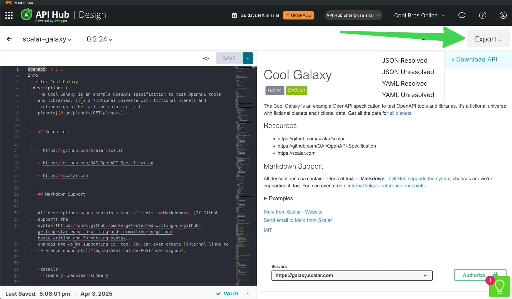
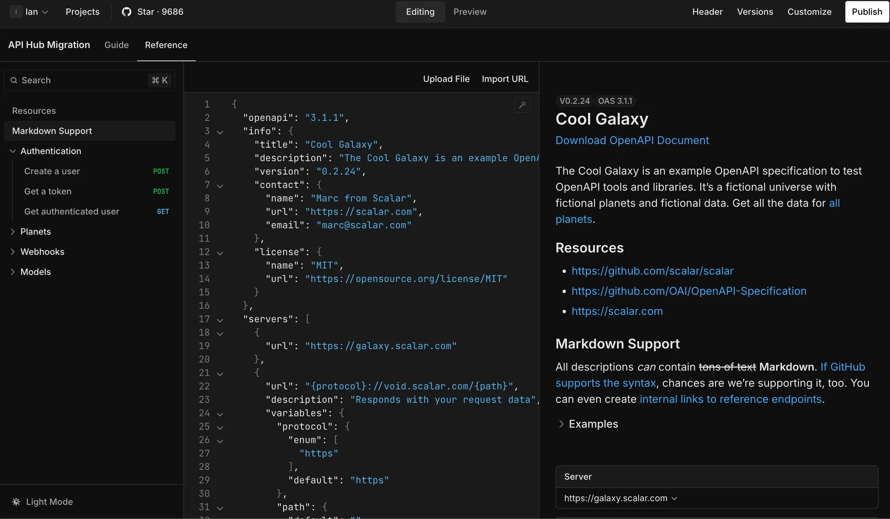
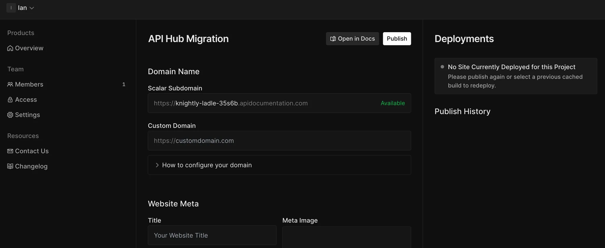
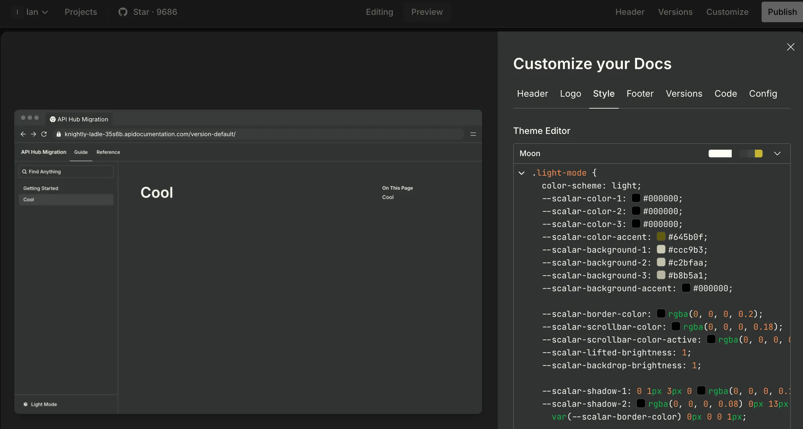
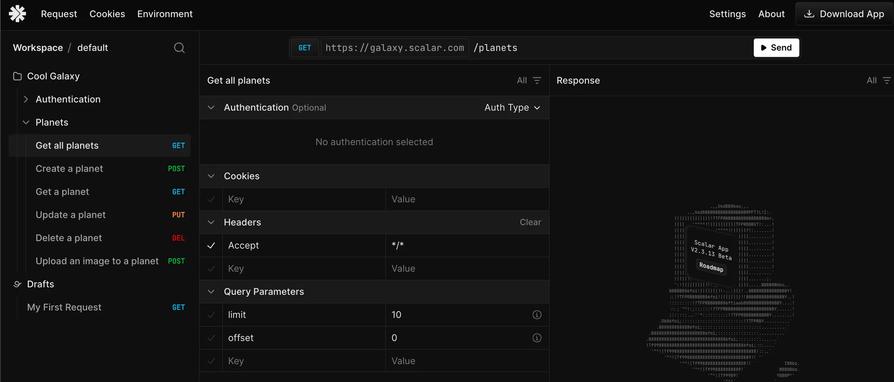

# How to migrate from SmartBear Swagger Studio (API Hub, ex. SwaggerHub) to Scalar

*Last updated: September 2026*

[Scalar](https://scalar.com/) is a drop-in replacement for SmartBear's design, portal, and explore tools. The naming has changed a few times, so here is the map. SwaggerHub became API Hub for Design, and on November 13, 2025, SmartBear [renamed API Hub for Design to Swagger Studio](https://support.smartbear.com/swagger/studio/docs/en/what-s-new.html). The documentation portal is [Swagger Portal](https://swagger.io/product/) (it replaced SwaggerHub's Docs Branding in 2024), and the API testing tool is Swagger Explore. SmartBear now groups them, along with Functional Testing, Contract Testing, and Catalog, under [Swagger / API Hub](https://swagger.io/product/). This guide uses "API Hub Design", "Portal", and "Explore" because that is what most existing projects still call them.

Scalar includes many of the same features as API Hub including:

1. A centralized location to edit and collaborate on OpenAPI and Swagger documents.
2. An interactive, customizable, and publishable API reference builder.
3. Custom domains, theming, and logos.
4. A built-in, local-first API client to help developers and end users call endpoints and test APIs.

Scalar is also [free to get started with](/pricing): the free plan covers up to 3 APIs with 1 editor seat, and the Pro plan is $150/month ($125/month billed yearly) with 5 editor seats included. If you want custom domains, GitHub sync, and a few other features, check out the Pro plan. SmartBear does not publish Swagger Studio prices on its product page, so compare against your own contract.

As a bonus, Scalar's API Reference and API Client are open source under the MIT licence, meaning you can self-host them and view all of the code on [GitHub](https://github.com/scalar/scalar).

Scalar does not try to replace everything in the SmartBear suite. If you rely on Functional Testing or Contract Testing, keep those, or pick a dedicated testing tool; Scalar covers design, documentation, the registry, and the API client.

## How to migrate from API Hub Design to Scalar

Migrating is as simple as exporting your API doc from API Hub Design and uploading it to Scalar.

To start, go into Swagger Studio (API Hub Design) and find the API you want to export. On the editor page, open the **Export** menu, which [lets you download your OpenAPI definition as YAML or JSON](https://support.smartbear.com/swagger/studio/docs/en/get-started/basics-of-swaggerhub.html). Choose the unresolved version to keep `$ref` values to other docs, or the resolved version to include everything inline.



With this exported JSON file, you can [sign up for Scalar](https://dashboard.scalar.com/register), create a new docs project, click the **References** tab of the newly created project, click **Upload File**, and select the file you exported from API Hub. This adds your OpenAPI doc to Scalar, ready to be edited, previewed, and published.



## How to migrate from API Hub Portal to Scalar

API Hub Portal enables you to publish an interactive version of your OpenAPI doc along with markdown guides.

In Scalar, you do not need to go to another product to do this. Just click the **Publish** button in the top right of your docs project. This brings you to a page where you can set your domain name, metadata, and more. Once ready, click **Publish** once more to deploy your site.



Adding guides is just as simple. In your Scalar docs project, click the **Guides** tab. There you can add and edit pages. The editor supports Markdown, so you can simply copy and paste docs from your API Hub Portal project.

Just like API Hub Portal this is completely customizable. Just click the **Customize** button to edit your header, logo, style, footer, version, code, and config.



### (Optional) Using GitHub Sync with scalar.config.json

If you prefer to manage your documentation via Git (similar to how API Hub Portal can work with version control), you can use Scalar's GitHub Sync feature. This allows you to keep your OpenAPI documents and Markdown guides in a Git repository and automatically publish when changes are merged.

To set this up, create a `scalar.config.json` file in your repository root:

```json
{
  "$schema": "https://registry.scalar.com/@scalar/schemas/config",
  "scalar": "2.0.0",
  "siteConfig": {
    "subdomain": "name-of-your-api"
  },
  "navigation": {
    "routes": {
      "/": {
        "type": "group",
        "title": "Your API",
        "children": {
          "/guides": {
            "type": "group",
            "title": "Guides",
            "children": {
              "getting-started": {
                "type": "page",
                "filepath": "docs/getting-started.md",
                "title": "Getting Started"
              }
            }
          },
          "/api": {
            "type": "openapi",
            "filepath": "openapi.yaml",
            "title": "API Reference"
          }
        }
      }
    }
  }
}
```

Configure automatic deployment (publish when a branch is merged into your main branch) in the [Scalar Dashboard](https://dashboard.scalar.com) under your project settings.

## How to migrate from API Hub Explore to Scalar

Scalar's API client is a direct replacement for API Hub Explore. Both you and your end users can get a version of it by clicking **Test Request** in the API reference or by going to the [API client page](https://client.scalar.com/). You can also [download a desktop version](/products/api-client/download).

Just like API Hub Explore, you can import existing API docs into the API client to get all the endpoints set up for testing. Once you have these, you can modify and send requests, add new routes, and much more to help explore and debug APIs.



## Link APIs from Design

The [Registry](/products/registry) matches API Hub Explore's “Link APIs from Design” feature: store your OpenAPI documents once, version them, and load them into the API client or your docs from one place.

## Frequently asked questions

<scalar-detail title="Is Swagger Studio the same thing as SwaggerHub?">
Yes. SwaggerHub was renamed API Hub for Design, and SmartBear [renamed that to Swagger Studio](https://support.smartbear.com/swagger/studio/docs/en/what-s-new.html) on November 13, 2025. The steps on this page apply whichever name your account shows.
</scalar-detail>

<scalar-detail title="Do I have to change my OpenAPI documents to move to Scalar?">
No. Export the document as JSON or YAML and upload it, or commit it to a Git repository and connect it with GitHub Sync. Scalar reads Swagger 2.0 and OpenAPI 3.x documents as they are.
</scalar-detail>

<scalar-detail title="What replaces Swagger Portal in Scalar?">
Scalar Docs. Publish your API reference and Markdown guides from the same project, add a custom domain on Pro, and customise the header, logo, and theme.
</scalar-detail>

<scalar-detail title="What replaces Swagger Explore?">
The Scalar API Client. It runs in the browser, inside your API reference, and as a desktop app, and it can import your OpenAPI documents so every endpoint is ready to test.
</scalar-detail>

<scalar-detail title="Can I generate SDKs from the same document?">
Yes. Scalar generates SDKs from your OpenAPI document. TypeScript, Python, Go, and CLI are generally available; Java, Kotlin, Ruby, C#, PHP, Rust, Swift, Dart, and C++ are experimental.
</scalar-detail>

## Related

- **Learn:** [What is an API reference?](/learn/openapi/what-is-an-api-reference) · [What is an API client?](/learn/openapi/what-is-an-api-client)
- **Docs:** [Scalar Registry](/products/registry) · [Download the API client](/products/api-client/download)
- **Product:** [Scalar Docs](/products/docs) — design, publish, and host your API reference and guides in one project

---

*SmartBear product names and features on this page come from SmartBear's [Swagger product page](https://swagger.io/product/) and [Swagger Studio documentation](https://support.smartbear.com/swagger/studio/docs/en/what-s-new.html) as checked on September 26, 2026. SmartBear has renamed these products several times and may do so again. If you find something wrong or out of date, please [open an issue](https://github.com/scalar/scalar/issues) and we will correct it.*
