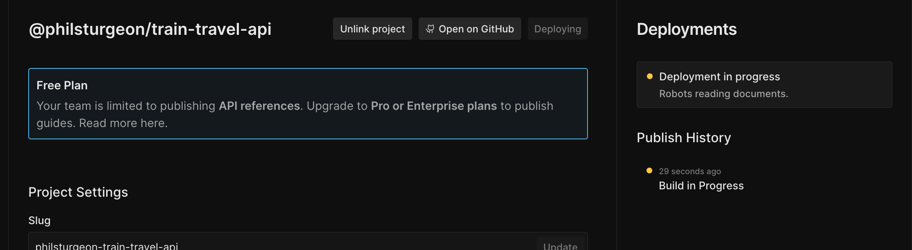
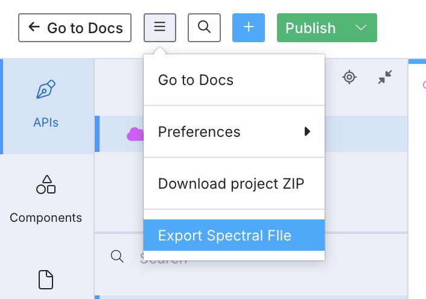

# How to migrate from Stoplight to Scalar

For a long time Stoplight was the scrappy underdog, taking on confusing unaffordable bloated enterprise solutions. Those days are long gone now it has been acquired by SmartBear. People are leaving Stoplight in droves, looking for modern alternatives, and we think Scalar is the logical fit thanks to the similarity of features and workflows:

1. Generating interactive API reference docs from OpenAPI.
2. Support for Markdown guides.
3. Works with both Design-first or Code-first API workflows.
4. Built-in team collaboration.
5. Custom domains, theming, and logos.
6. Hosted or embeddable as web or React component.

On top of this, Scalar provides added benefits like:

- **Better SaaS pricing.** Most of the features of Scalar can be used for free and the pro plan is only $24/month compared to Stoplight’s $52/month.
- **Open Source.** Scalar is fully open source and can be self-hosted, something Stoplight phased out years ago.
- **Built-in API client.** Scalar has also built an API client into the API reference, enabling users to send test requests straight from the docs.

## How does migrating work?

With Stoplight and Scalar offering quite a few features on top of the "turn OpenAPI into docs" use case it can feel daunting to consider a migration, but we've got your back. Generally it looks a little like this:

1. Move OpenAPI documents over.
1. Link up your Git repos.
1. Make sure you like the look of the new API documentation.
1. (Optional) Migrate Markdown topics and guides.
1. (Optional) Move custom linting rulesets over.
1. (Optional) Point custom domains to Scalar.
1. (Optional) Set up redirects from old Stoplight docs to new Scalar docs.

Before we get stuck into the technical aspects, let's consider how Scalar fits into the larger workflow.

## API Design-first or Code-first

Some API teams generate OpenAPI from code, whether that's [code annotations/comments](), a DSL like [RSwag](https://github.com/rswag/rswag), or increasingly popular [OpenAPI-aware frameworks](https://apisyouwonthate.com/blog/code-first-how-to-generate-openapi-files-in-2024/). Whichever tool is being used, the process is generally the same.

Those documents being generated then committed to Git, by some sort of build script or continuous integration. Scalar can happily read those same committed OpenAPI and Markdown content from Git.

If the generated OpenAPI is being powered by Stoplight CLI without Git then that could be a straight swap to use the Scalar CLI to push documents to the Scalar Registry (or run both for a while and see how things look.) Or you could take the chance to migrate to using Git, as it's generally considered best practice to keep the OpenAPI/Markdown alongside the source code.

Teams following the code-first workflow with Stoplight are probably using the OpenAPI editor Stoplight Studio, using either the long discontinued desktop application, or the hosted editor functionality in Stoplight Platform. Scalar has an [Editor interface](https://editor.scalar.com/) which can be used in the same way, allowing for changes to be made and pushed to the Scalar Registry, and/or synced back to Git. The registry makes OpenAPI documents available for other tools in the workflow, so they can access the latest OpenAPI, or peg to a particular version.


With that in mind, let's look at how you can switch to a cheaper and better OpenAPI editor and documentation tool.

## Step 1: Create a free Scalar account

Scalar has a free tier, and you can get quite a lot done with it. No credit card needed or gimmick trials that are hard to cancel, just [register over here](https://dashboard.scalar.com/register).

## Step 2: Introduce your OpenAPI to Scalar

Stoplight had various flavors of project: Web Projects, Git Projects, Local Projects. We're going to make life easy and show you all how to convert to Git projects, and you can play around with others approaches once you've got the hang of the basics.

### Git Projects

Migrating a Stoplight "Git Project" is as simple as enabling GitHub Sync for Scalar. Stoplight was just pushing and pulling from a Git repo, and Scalar can do that too. This is built in, not some awkward GitHub Action.

To use GitHub Sync go to the dashboard, click **Create Documentation**, then select **GitHub Sync**. Pick the appropriate organization from the dropdown and find the repository to link.


Click the **Link Repository** link next to the repository of interest, and a page will appear with some GitHub Repository Settings will appear. The defaults are probably all fine, but perhaps you're using a special branch called `docs` or a particular version branch like `v3` instead of `main`.

All of this can be changed later so pick whatever and click publish, it'll be private by default so no worries about anyone seeing anything that's not ready.

### Web Projects: Exporting Stoplight Web Projects

Exfiltrating your OpenAPI and Markdown from Stoplight is as simple as exporting a ZIP file of your OpenAPI and other documents.

Go to your project’s studio page, and click the three line drop down to reveal the **Download project ZIP** option.


If you only want the OpenAPI document, you could just go to your doc page, click **Export** and then choose **Bundled** to make sure you get any `$ref` to other files included.


Let's switch these to Git Sync projects to keep the source of truth entirely under your control. To do this we can create a new repository to help track changes, or merge the downloaded OpenAPI/Markdown into the existing source code repository.

Whichever approach you pick, once you've got the OpenAPI/Markdown content into a repository, you can scroll up to the Git Sync section in this guide to bring that repo into Scalar.

## Step 3: Scalar Config

Once the project is hooked up to Scalar, the next step is to set up the Scalar config file.  By creating a `scalar.config.json` file we can add the details on where the OpenAPI documents live, and where the guides are sitting.

```json
{
  "$schema": "https://cdn.scalar.com/schema/scalar-config-next.json",
  "scalar": "2.0.0",
  "publishOnMerge": true,
  "siteConfig": {
    "subdomain": "name-of-your-api"
  },
  "navigation": {
    "routes": {
      "/": {
        "type": "group",
        "title": "Train Travel API",
        "children": {
          "/guides": {
            "type": "group",
            "title": "Guides",
            "children": {
              "getting-started": {
                "type": "page",
                "filepath": "docs/getting-started.md",
                "title": "Getting Started"
              }
            }
          },
          "/api": {
            "type": "openapi",
            "url": "openapi.yaml",
            "title": "API Reference"
          }
        }
      }
    }
  }
}
```

The `"publishOnMerge": true` tells Scalar to publish your documentation when a branch is merged into the selected branch, instead of anyone having to manually publish it.



The Stoplight sidebar content can be found in `toc.json`, and converted in your favorite text editor.

Take this example `toc.json` from a Stoplight project.

```json
{
  "items": [
    {
      "type": "item",
      "title": "Getting Started",
      "uri": "docs/getting-started.md"
    },
    {
      "type": "item",
      "title": "Hello World",
      "uri": "docs/hello-world.md"
    }
  ]
}
```

Copy and paste that chunk of JSON out of there, and make the following changes.

1. Change `type: item` to `type: page`.
2. Change `uri` to `filepath`.
3. Keep the `title` field.

```json
{
  "$schema": "https://cdn.scalar.com/schema/scalar-config-next.json",
  "scalar": "2.0.0",
  "publishOnMerge": true,
  "siteConfig": {
    "subdomain": "name-of-your-api"
  },
  "navigation": {
    "routes": {
      "/": {
        "type": "group",
        "title": "Train Travel API",
        "children": {
          "/guides": {
            "type": "group",
            "title": "Guides",
            "children": {
              "getting-started": {
                "type": "page",
                "filepath": "docs/getting-started.md",
                "title": "Getting Started"
              },
              "hello-world": {
                "type": "page",
                "filepath": "docs/hello-world.md",
                "title": "Hello World"
              }
            }
          },
          "/api": {
            "type": "openapi",
            "url": "openapi.yaml",
            "title": "API Reference"
          }
        }
      }
    }
  }
}
```

> [!NOTE]
> You can create more complex sidebars with nested pages and more. See this example [scalar.config.json](https://raw.githubusercontent.com/scalar/scalar/refs/heads/main/scalar.config.json) to see how it works.

Commit this file off to the Git repo and push. If `"publishOnMerge": true,` has been added to the config file then a new entry under Deployments should appear, and when that's done we can go and see how it all looks.

## Step 4: Review The New Documentation

Click the deployment to see find the projects docs URL, something like `https://name-of-your-api.apidocumentation.com`.

This will show two distinct sections.

1. Guides
2. Each OpenAPI Reference

Projects with multiple OpenAPI documents will see each of them popped along the top navigation, using the name provided in `scalar.config.json`.

Click around. See how you like the place. Enjoy the slick new interactive API console on each endpoint.

## Step 5: (Optional) Export Spectral ruleset

This step is only for those using custom Spectral rulesets. If this sounds like nonsense then that answers that question, you probably weren't using them.

Spectral is an open-source tool Stoplight forked from other popular OpenAPI linters a few years ago. By default it reports on whether an OpenAPI document is valid, whether it has syntax errors or invalid keywords, so if you were using Stoplight Studio and seeing "Missing required keyword" type errors; that was Spectral. Scalar supports Spectral so you will continue to see the same errors and warnings in Scalar Editor.

That might not be the end of the story though, as Spectral also supports custom rulesets. These are most often built by API governance teams, or other tech-minded folks who want to ensure consistency across the APIs being designed. The rulesets could be [automating API Style Guides](https://apisyouwonthate.com/blog/automated-style-guides-for-rest-graphql-grpc/), pushing people towards standards, or away from poor practices.

To migrate any custom Spectral rulesets hosted in Stoplight Platform, head to Studio, and click **Export Spectral File**.



Maybe this is just turning some rules on and off.

Maybe it is defining custom rules.

Be aware rules with custom functions wont work, so just comment those out.

## Step 6: (Optional) Update Custom Domains

Once you're happy with your new API documentation, it's time to bring the API client developers along too. Those of you with a custom domain pointing to Stoplight (something like `developers.acme.com`) can update the CNAME to point to Scalar.

First off, [add the custom domain](../guides/docs/configuration/domains.md) to your Scalar config.

```json
// scalar.config.json
{
  "siteConfig": {
    "subdomain": "name-of-your-api",
    "customDomain": "docs.example.com"
  }
  // ...
}
```

Then pop over to your DNS and update the CNAME from `developers` (or whatever your subdomain is) from the old Stoplight DNS to `dns.scalar.com`. Give it a few minutes and it should be ready to go.

## Step 7: (Optional) Add Redirects

If you had a lot of traffic going to your Stoplight docs, you might want to set up some redirects to make sure existing links keep working. Scalar supports redirects via the `siteConfig.routing.redirects` configuration in `scalar.config.json`.

If you were using a custom domain with Stoplight hosted documentation then the paths will be passed to Scalar after Step 6. This means Scalar's redirects can be used to point old paths to new ones.

```json
// scalar.config.json
{
  "siteConfig": {
    "routing": {
      "redirects": [{
        "from": "/docs/<stoplight-project>/10a1321b3-:wildcard",
        "to": "/scalar/scalar-registry/github-actions"
      }]
    }
  }
  // ...
}
```

Learn more about [redirects](../guides/docs/configuration/redirects.md).

## Summary

The biggest advantage in this migration is that both tools are fundamentally OpenAPI-based, which means your core specifications will transfer cleanly.

Most teams can complete this migration in somewhere between a few hours and a few days, depending on how many projects and APIs need moving over. Larger enterprises will take slightly longer depending on the complexity of their API ecosystem.

Scalar's team is happy to offer migration assistance and consultation to help streamline this process, particularly for teams with complex Stoplight implementations. The team consist of experts that helped build Stoplight in the first place, so they're well placed to help migrate anyone regardless of the size or complexity of the projects.
