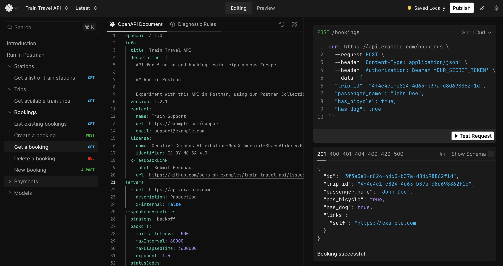
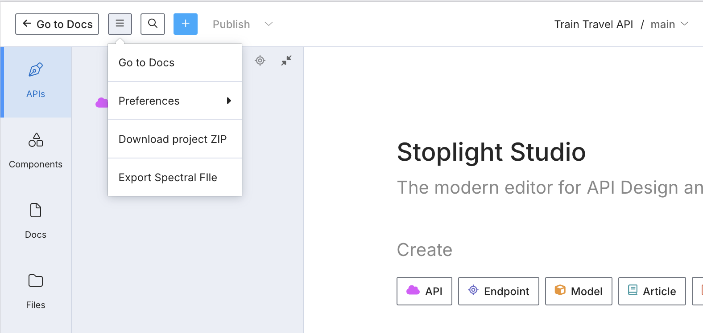
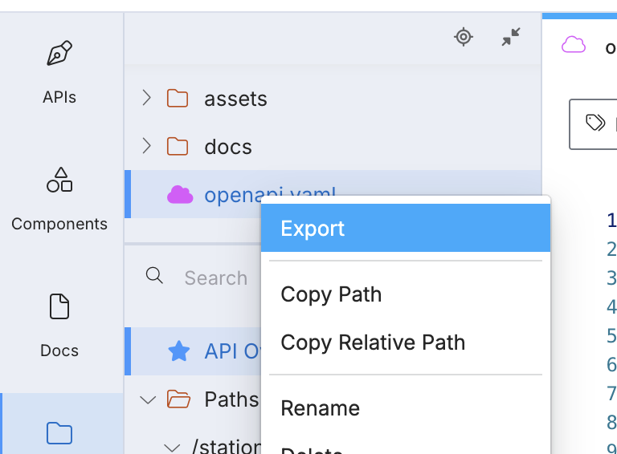
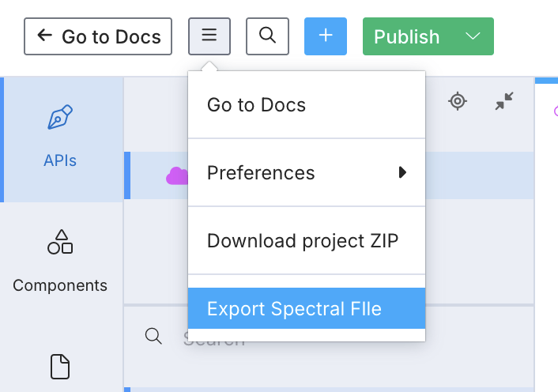

# How to migrate from Stoplight to Scalar

*Last updated: September 2026*

Stoplight built a well-loved API design platform: a visual OpenAPI editor, hosted docs, Spectral linting, and Prism mocking. SmartBear [announced it was acquiring Stoplight](https://smartbear.com/news/news-releases/smartbear-to-acquire-stoplight/) on August 22, 2023. Stoplight is still sold today, with a [free plan and paid tiers](https://stoplight.io/pricing), and we have not found an official end-of-life notice from SmartBear. Some in the community have noticed a slowdown, though. [APIs You Won't Hate wrote in October 2025](https://apisyouwonthate.com/newsletter/goodbye-stoplight/) that "work on Stoplight appears to be slowing" as SmartBear folds its features into API Hub.

If that has you looking around, Scalar is a natural fit because the features and workflows line up closely:

1. Generating interactive API reference docs from OpenAPI.
2. Support for Markdown guides.
3. Works with both Design-first or Code-first API workflows.
4. Built-in team collaboration.
5. Custom domains, theming, and logos.
6. Hosted or embeddable as web or React component.

On top of this, Scalar provides:

- **A free plan.** Scalar's free plan covers up to 3 APIs with 1 editor seat, and Pro is $150/month ($125/month billed yearly) with 5 editor seats included. To be fair, Stoplight's paid plans start lower: as of September 2026, [Stoplight Basic](https://stoplight.io/pricing) is $44/month billed annually for 3 users, and Startup, which adds custom domains, is $113/month billed annually for 8 users.
- **Open source.** Scalar's API Reference and API Client are MIT licensed and can be self-hosted. Stoplight's [Elements](https://github.com/stoplightio/elements), [Spectral](https://github.com/stoplightio/spectral), and Prism are open source too, under Apache 2.0, so if you only use those, you may not need to move at all.
- **Built-in API client.** Scalar has an API client built into the API reference, so readers can send test requests straight from the docs.
- **SDKs and MCP servers.** Scalar generates SDKs (TypeScript, Python, Go, Java, Kotlin, Ruby, and CLI are generally available; C#, PHP, Rust, Swift, Dart, and C++ are experimental) and hosts MCP servers from the same OpenAPI document.

## How does migrating work?

With Stoplight and Scalar offering quite a few features on top of the "turn OpenAPI into docs" use case, a migration can feel daunting. It breaks down into manageable steps. Generally it looks a little like this:

1. Move OpenAPI documents over.
1. Link up your Git repos.
1. Make sure you like the look of the new API documentation.
1. (Optional) Migrate Markdown topics and guides.
1. (Optional) Move custom linting rulesets over.
1. (Optional) Point custom domains to Scalar.
1. (Optional) Set up redirects from old Stoplight docs to new Scalar docs.

Before we get stuck into the technical aspects, let us consider how Scalar fits into the larger workflow.

## API Design-first or Code-first

Some API teams generate OpenAPI from code, whether that is code annotations or comments, a DSL like [RSwag](https://github.com/rswag/rswag), or increasingly popular [OpenAPI-aware frameworks](https://apisyouwonthate.com/blog/code-first-how-to-generate-openapi-files-in-2024/). Whichever tool is being used, the process is generally the same.

Those documents being generated then committed to Git, by some sort of build script or continuous integration. Scalar can happily read those same committed OpenAPI and Markdown content from Git.

If the generated OpenAPI is being powered by Stoplight CLI without Git then that could be a straight swap to use the Scalar CLI to push documents to the Registry (or run both for a while and see how things look.) Or you could take the chance to migrate to using Git, as it is generally considered best practice to keep the OpenAPI/Markdown alongside the source code.

Teams following the design-first workflow with Stoplight are probably using the OpenAPI editor Stoplight Studio, either the desktop application or the hosted editor in Stoplight Platform. Scalar has an [editor in the dashboard](https://dashboard.scalar.com/apis) which can be used in the same way, allowing for changes to be made and pushed to the Registry. The registry makes OpenAPI documents available for other tools in the workflow, so they can access the latest OpenAPI, or peg to a particular version.



With that in mind, let us look at how to make the switch.

## Step 1: Create a free Scalar account

Scalar has a free tier, and you can get quite a lot done with it. No credit card needed, just [register over here](https://dashboard.scalar.com/register).

## Step 2: Introduce your OpenAPI to Scalar

Stoplight had various flavors of project: Web Projects, Git Projects, Local Projects. We are going to make life easy and show you all how to convert to Git projects, and you can play around with other approaches once you have got the hang of the basics.

### Git Projects

Migrating a Stoplight "Git Project" is as simple as enabling GitHub Sync for Scalar. Stoplight was just pushing and pulling from a Git repo, and Scalar can do that too. This is built in, not some awkward GitHub Action.

To use Git Sync, open **Docs** in the [dashboard](https://dashboard.scalar.com/docs) and click **New Project**. Name your project, choose **Import Docs**, pick **GitHub** (or **Bitbucket**), and click **Continue**. Select your organization, pick the repository, and click **Connect repository**.

<!-- TODO screenshot: the Import Docs flow with a repository selected -->

If you keep your docs on a special branch, like `docs` or a version branch like `v3` instead of `main`, change the branch Scalar publishes from in the editor under **Settings → Git Sync**.

New projects are public: once published, anyone with the address can read them. To keep your site private while you get it ready, turn on **Private site** under **Settings → Privacy** before you publish. See [Private Docs](../guides/docs/configuration/private-docs.md).

### Web Projects: Exporting Stoplight Web Projects

Exfiltrating your OpenAPI and Markdown from Stoplight is as simple as exporting a ZIP file of your OpenAPI and other documents.

Go to your project’s studio page, and click the three line drop down to reveal the **Download project ZIP** option.



If you only want the OpenAPI document, you could just go to your doc page, click **Export** and then choose **Bundled** to make sure you get any `$ref` to other files included.



Let us switch these to Git Sync projects to keep the source of truth entirely under your control. To do this we can create a new repository to help track changes, or merge the downloaded OpenAPI/Markdown into the existing source code repository.

Whichever approach you pick, once you have got the OpenAPI/Markdown content into a repository, you can scroll up to the Git Sync section in this guide to bring that repo into Scalar.

## Step 3: Scalar Config

Once the project is hooked up to Scalar, the next step is to set up the Scalar config file.  By creating a `scalar.config.json` file we can add the details on where the OpenAPI documents live, and where the guides are sitting.

```json
{
  "$schema": "https://registry.scalar.com/@scalar/schemas/config",
  "scalar": "2.0.0",
  "siteConfig": {
    "subdomain": "name-of-your-api"
  },
  "navigation": {
    "routes": {
      "/": {
        "type": "group",
        "title": "Train Travel API",
        "children": {
          "/guides": {
            "type": "group",
            "title": "Guides",
            "children": {
              "getting-started": {
                "type": "page",
                "filepath": "docs/getting-started.md",
                "title": "Getting Started"
              }
            }
          },
          "/api": {
            "type": "openapi",
            "filepath": "openapi.yaml",
            "title": "API Reference"
          }
        }
      }
    }
  }
}
```

Automatic deployment publishes your site whenever changes land on your tracked branch, and it is on by default. Change it, or the branch Scalar publishes from, in the editor under **Settings → Git Sync**.

<!-- TODO screenshot: Settings → Git Sync -->

The Stoplight sidebar content can be found in `toc.json`, and converted in your favorite text editor.

Take this example `toc.json` from a Stoplight project.

```json
{
  "items": [
    {
      "type": "item",
      "title": "Getting Started",
      "uri": "docs/getting-started.md"
    },
    {
      "type": "item",
      "title": "Hello World",
      "uri": "docs/hello-world.md"
    }
  ]
}
```

Copy and paste that chunk of JSON out of there, and make the following changes.

1. Change `type: item` to `type: page`.
2. Change `uri` to `filepath`.
3. Keep the `title` field.

```json
{
  "$schema": "https://registry.scalar.com/@scalar/schemas/config",
  "scalar": "2.0.0",
  "siteConfig": {
    "subdomain": "name-of-your-api"
  },
  "navigation": {
    "routes": {
      "/": {
        "type": "group",
        "title": "Train Travel API",
        "children": {
          "/guides": {
            "type": "group",
            "title": "Guides",
            "children": {
              "getting-started": {
                "type": "page",
                "filepath": "docs/getting-started.md",
                "title": "Getting Started"
              },
              "hello-world": {
                "type": "page",
                "filepath": "docs/hello-world.md",
                "title": "Hello World"
              }
            }
          },
          "/api": {
            "type": "openapi",
            "filepath": "openapi.yaml",
            "title": "API Reference"
          }
        }
      }
    }
  }
}
```

> [!NOTE]
> You can create more complex sidebars with nested pages and more. See this example [scalar.config.json](https://raw.githubusercontent.com/scalar/scalar/refs/heads/main/scalar.config.json) to see how it works.

Commit this file and push. With automatic deployment on, the push to your tracked branch starts a publish, and it shows up in the editor's **Activity** panel. When that is done you can see how it all looks.

## Step 4: Review The New Documentation

Click the deployment to find the project's docs URL, something like `https://name-of-your-api.apidocumentation.com`.

This will show two distinct sections.

1. Guides
2. Each OpenAPI Reference

Projects with multiple OpenAPI documents will see each of them popped along the top navigation, using the name provided in `scalar.config.json`.

Click around. See how you like the place. Enjoy the slick new interactive API console on each endpoint.

## Step 5: (Optional) Export Spectral ruleset

This step is only for those using custom Spectral rulesets. If you have never heard of them, you probably were not using them.

[Spectral](https://github.com/stoplightio/spectral) is the open-source linter Stoplight created, now Apache 2.0 licensed under SmartBear. By default it reports on whether an OpenAPI document is valid, whether it has syntax errors or invalid keywords, so if you were using Stoplight Studio and seeing "Missing required keyword" type errors; that was Spectral. Scalar supports Spectral so you will continue to see the same errors and warnings in Scalar Editor.

That might not be the end of the story though, as Spectral also supports custom rulesets. These are most often built by API governance teams, or other tech-minded folks who want to ensure consistency across the APIs being designed. The rulesets could be [automating API Style Guides](https://apisyouwonthate.com/blog/automated-style-guides-for-rest-graphql-grpc/), pushing people towards standards, or away from poor practices.

To migrate any custom Spectral rulesets hosted in Stoplight Platform, head to Studio, and click **Export Spectral File**.



Maybe this is just turning some rules on and off.

Maybe it is defining custom rules.

Be aware rules with custom functions will not work, so just comment those out.

## Step 6: (Optional) Update Custom Domains

Once you are happy with your new API documentation, it is time to bring the API client developers along too. Those of you with a custom domain pointing to Stoplight (something like `developers.acme.com`) can update the CNAME to point to Scalar.

First off, [add the custom domain](/products/docs/configuration/domains) to your Scalar config.

```json
// scalar.config.json
{
  "siteConfig": {
    "subdomain": "name-of-your-api",
    "customDomain": "docs.example.com"
  }
  // ...
}
```

Then pop over to your DNS and update the CNAME from `developers` (or whatever your subdomain is) from the old Stoplight DNS to `dns.scalar.com`. Give it a few minutes and it should be ready to go.

## Step 7: (Optional) Add Redirects

If you had a lot of traffic going to your Stoplight docs, you might want to set up some redirects to make sure existing links keep working. Scalar supports redirects via the `siteConfig.routing.redirects` configuration in `scalar.config.json`.

If you were using a custom domain with Stoplight hosted documentation then the paths will be passed to Scalar after Step 6. This means Scalar's redirects can be used to point old paths to new ones.

```json
// scalar.config.json
{
  "siteConfig": {
    "routing": {
      "redirects": [{
        "from": "/docs/<stoplight-project>/10a1321b3-:wildcard",
        "to": "/guides/getting-started"
      }]
    }
  }
  // ...
}
```

Learn more about [redirects](/products/docs/configuration/redirects).

## Summary

The biggest advantage in this migration is that both tools are fundamentally OpenAPI-based, which means your core specifications will transfer cleanly.

Most teams can complete this migration in somewhere between a few hours and a few days, depending on how many projects and APIs need moving over. Larger enterprises will take slightly longer depending on the complexity of their API ecosystem.

Scalar's team is happy to offer migration assistance and consultation to help streamline this process, particularly for teams with complex Stoplight implementations. [Talk to us](https://scalar.cal.com/) if you would like help.

## Frequently asked questions

<scalar-detail title="Is Stoplight being shut down?">
We have not found an official end-of-life announcement from SmartBear, and Stoplight's [pricing page](https://stoplight.io/pricing) still sells free and paid plans as of September 2026. Community writers have noted slower development since the [2023 acquisition](https://smartbear.com/news/news-releases/smartbear-to-acquire-stoplight/), so it is reasonable to plan ahead, but there is no deadline forcing a move.
</scalar-detail>

<scalar-detail title="Will my Spectral rulesets work in Scalar?">
Yes, for the most part. Scalar supports Spectral, so exported rulesets carry over. Rules that rely on custom JavaScript functions will not run, so comment those out and replace them where you can.
</scalar-detail>

<scalar-detail title="Do I need to change my OpenAPI documents to move from Stoplight?">
No. Both tools are OpenAPI-based. Export your documents bundled so any cross-file `$ref` values come with them, or connect the same Git repository to Scalar.
</scalar-detail>

<scalar-detail title="How do I convert Stoplight's toc.json into Scalar navigation?">
Copy each item into the `navigation.routes` section of `scalar.config.json`, change `type: item` to `type: page`, and rename `uri` to `filepath`. Step 3 above walks through an example.
</scalar-detail>

<scalar-detail title="Does Scalar replace Prism mock servers?">
Scalar has its own mock server that generates responses from your schemas, which you can run with `npx @scalar/cli document mock openapi.json`. Prism is open source, so you can also keep running it alongside Scalar.
</scalar-detail>

## Related

- **Learn:** [Spectral rules](/learn/openapi/spectral-rules) · [API mocking](/learn/openapi/api-mocking)
- **Docs:** [Stoplight alternatives](/alternatives/stoplight) · [Scalar vs Stoplight comparison](/resources/compare/stoplight) · [Docs configuration](/products/docs/configuration/domains)
- **Product:** [Scalar Docs](/products/docs) — Git-synced docs and API references, the closest match to Stoplight's hosted docs

---

*Stoplight details on this page come from its [pricing page](https://stoplight.io/pricing), SmartBear's [acquisition announcement](https://smartbear.com/news/news-releases/smartbear-to-acquire-stoplight/), and Stoplight's GitHub repositories as checked on September 26, 2026. We could not find an official statement on Stoplight's long-term future and have said so rather than guess. If something here is wrong or out of date, please [open an issue](https://github.com/scalar/scalar/issues) and we will correct it.*
