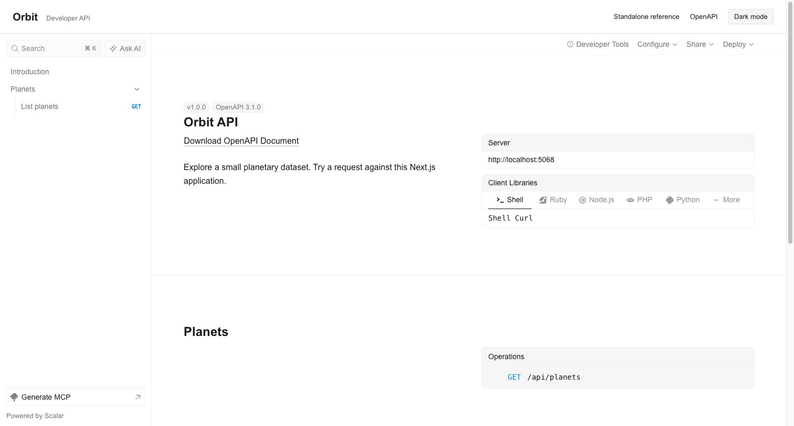

# Scalar for Next.js

Run a standalone reference or embed it in a Next.js application with navigation, page metadata, and a shared light/dark theme.

## Run from the Scalar repository

Use Node.js 22 or newer and the repository's pnpm version. From the repository root:

```bash
pnpm install
pnpm turbo --filter @scalar-examples/nextjs-api-reference... build
pnpm --filter @scalar-examples/nextjs-api-reference dev
```

Open <http://localhost:5058/scalar>. The development server uses port **5058**.

| Route                        | Purpose                                                        |
| ---------------------------- | -------------------------------------------------------------- |
| `/scalar`                    | Standalone HTML reference                                      |
| `/embedded`                  | App Router page with application navigation and theme controls |
| `/openapi.json`              | OpenAPI description used by both references                    |
| `/api/planets`               | Working sample endpoint                                        |
| `/client`, `/another-client` | Additional React API client examples                           |

The root redirects to `/scalar`. The older `/another-reference` page redirects to `/embedded`.

## Try the API

Open **List planets**, select **Test Request**, then send the request. The response contains Earth and Mars. You can also run:

```bash
curl http://localhost:5058/api/planets
```

The OpenAPI description is written explicitly in `app/openapi.json/route.ts`. The reference handler does not generate it from your routes.

## Files to change

- `app/scalar/route.ts`: standalone reference configuration.
- `app/embedded/page.tsx`: page metadata in a Server Component.
- `app/embedded/reference.tsx`: Client Component and shared theme control.
- `app/embedded/style.css`: application font and navigation styles.
- `app/api/planets/route.ts`: sample API response.

The standalone handler returns its own HTML document. The embedded page inherits `app/layout.tsx`. Both fetch the API description from this application, so requests work on localhost and preview deployments without a fixed hostname.

## Production

```bash
pnpm --filter @scalar-examples/nextjs-api-reference build
pnpm --filter @scalar-examples/nextjs-api-reference start
```

The production server defaults to port 3000. Open <http://localhost:3000/scalar>.

## Preview




