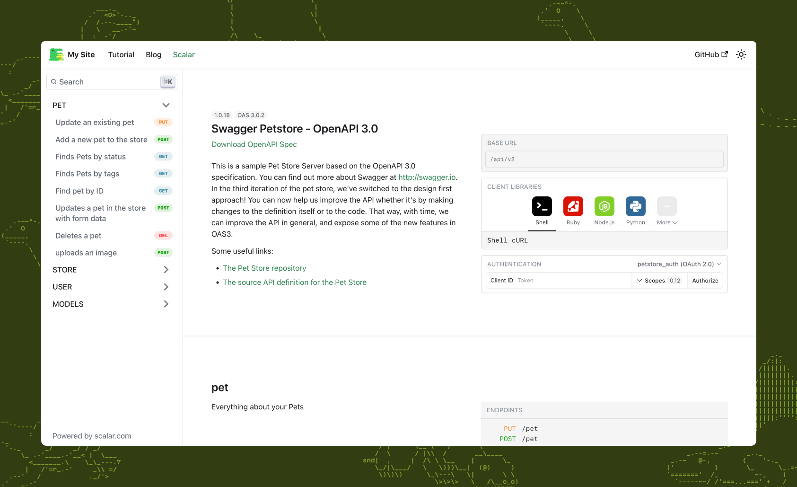

# Scalar Docusaurus API Reference Plugin "Scalasaurus"

[](https://www.npmjs.com/package/@scalar/docusaurus)
[](https://www.npmjs.com/package/@scalar/docusaurus)
[](https://www.npmjs.com/package/@scalar/docusaurus)
[](https://discord.gg/8HeZcRGPFS)



## Installation

```bash
npm install @scalar/docusaurus
```

## Usage

Simply add to the plugins section of your Docusaurus config. If you are using Typescript you can import the type options type as well.

```ts
import type { ScalarOptions } from '@scalar/docusaurus'

plugins: [
  [
    '@scalar/docusaurus',
    {
      label: 'Scalar',
      route: '/scalar',
      showNavLink: true, // optional, default is true
      configuration: {
        spec: {
          url: 'https://cdn.jsdelivr.net/npm/@scalar/galaxy/dist/latest.yaml',
        },
      },
    } as ScalarOptions,
  ],
],
```

We wrote a [detailed integration guide for Docusaurus](https://github.com/scalar/scalar/tree/main/documentation/integrations/docusaurus.md).

### Multiple API descriptions

Is it possible to show multiple API descriptions? Yes, it is! :)

```ts
import type { ScalarOptions } from '@scalar/docusaurus'

plugins: [
  // First API definition
  [
    '@scalar/docusaurus',
    {
      // the `id` is required if you have multiple instances of the @scalar/docusaurus plugin
      id: 'scalar/galaxy',
      label: 'Scalar',
      route: '/scalar',
      showNavLink: true, // optional, default is true
      configuration: {
        spec: {
          url: 'https://cdn.jsdelivr.net/npm/@scalar/galaxy/dist/latest.json',
        },
      },
    } as ScalarOptions,
  ],
  // Second API definition
  [
    '@scalar/docusaurus',
    {
      // the `id` is required if you have multiple instances of the @scalar/docusaurus plugin
      id: 'petstore',
      label: 'Petstore',
      route: '/petstore',
      showNavLink: true, // optional, default is true
      configuration: {
        spec: {
          url: 'https://petstore3.swagger.io/api/v3/openapi.json',
        },
      },
    } as ScalarOptions,
  ],
],
```

### Example

You can find an example in this repo under [examples/docusaurus](https://github.com/scalar/scalar/tree/main/examples/docusaurus)

## Config

These configuration options are a WIP as this plugin is still in beta

### label: string

The label on the nav bar for this route

### route: string

Path at which the API Reference will be shown

### configuration: ReferenceProps

You can find the full configuration options under
[packages/api-reference](https://github.com/scalar/scalar/tree/main/packages/api-reference)
minus theme.

## Community

We are API nerds. You too? Let’s chat on Discord: <https://discord.gg/scalar>

## License

The source code in this repository is licensed under [MIT](https://github.com/scalar/scalar/blob/main/LICENSE).
