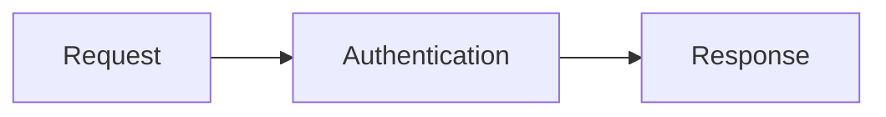

# Scalar Mermaid Plugin

Opt-in Mermaid diagrams for `@scalar/api-reference`. The plugin enhances Mermaid code fences throughout Markdown descriptions, including summaries and the embedded API client.

## Install

```sh
npm install @scalar/api-reference @scalar/mermaid-plugin
```

## Enable

```ts
import { createApiReference } from '@scalar/api-reference'
import { mermaidPlugin } from '@scalar/mermaid-plugin'

createApiReference('#app', {
  url: '/openapi.json',
  plugins: [mermaidPlugin()],
})
```

Write a fenced `mermaid` block in any Markdown description:

````markdown

````

Use **Zoom in**, **Zoom out**, and **Reset view** to explore the diagram. Drag to pan, or focus the diagram and use the arrow keys. Mermaid loads only when an enabled plugin encounters a Mermaid fence. Without the plugin, fences remain ordinary code blocks. Invalid diagrams keep their source visible.

Rendering runs in the browser after Markdown is sanitized. Server rendering keeps the code block until hydration. Mermaid uses its strict security mode; diagram callbacks and custom HTML are not enabled. Rendered content is disposed when Markdown changes or the reference is destroyed.

## Custom Markdown plugins

An API Reference plugin can provide a `markdown` hook:

```ts
const myPlugin = () => ({
  name: 'my-markdown-plugin',
  extensions: [],
  markdown: ({ element, source, signal }) => {
    // Enhance descendants of this sanitized Markdown container.
    // Check signal.aborted after asynchronous work.
    return () => {
      // Remove listeners or resources owned by this rendering.
    }
  },
})
```

The hook receives the original source, the rendered container, and a cancellation signal. It can return a cleanup callback or a promise for one. Hooks are scoped to their API Reference instance and must be registered in the initial configuration. Mark block-level enhancements with `data-markdown-block` so collapsed Markdown summaries hide the complete block until expansion. Treat the Markdown source as untrusted and sanitize any HTML that your plugin adds.
