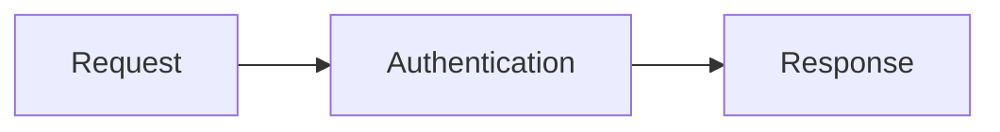

# Scalar Mermaid Plugin

Opt-in Mermaid diagrams for `@scalar/api-reference`. The plugin enhances Mermaid code fences throughout Markdown descriptions, including summaries and the embedded API client.

This package is private while its initial npm release and trusted publisher are being set up. The installation command below applies after publication.

## Install

```sh
npm install @scalar/api-reference @scalar/mermaid-plugin
```

## Enable

```ts
import { createApiReference } from '@scalar/api-reference'
import { mermaidPlugin } from '@scalar/mermaid-plugin'

createApiReference('#app', {
  url: '/openapi.json',
  plugins: [mermaidPlugin()],
})
```

Write a fenced `mermaid` block in any Markdown description:

````markdown

````

Use **Zoom in**, **Zoom out**, and **Reset view** to explore the diagram. Drag to pan, or focus the diagram and use the arrow keys. Mermaid loads only when an enabled plugin encounters a Mermaid fence. Without the plugin, fences remain ordinary code blocks. Invalid diagrams keep their source visible.

Rendering runs in the browser after Markdown is sanitized. Server rendering keeps the code block until hydration. Rendered content is disposed when Markdown changes or the reference is destroyed.

## Security and opt-in

Enable this plugin explicitly only when you accept Mermaid as an additional rendering and sanitization dependency. Diagram source comes from the API description and may be untrusted, including in hosted references. Scalar sanitizes Markdown before the hook runs, but it does not sanitize the SVG inserted by this plugin afterward: Mermaid's sanitizer is the security boundary for that generated content.

The plugin initializes Mermaid with `securityLevel: 'strict'`, which sanitizes diagram content and disables callbacks. Do not weaken that setting through another Mermaid integration on the same page. Keep Mermaid updated as security fixes become available. Without the plugin, Mermaid fences remain ordinary sanitized code blocks.

## Styling

The viewer uses Scalar's border, background, text, radius, and focus tokens, so its frame and controls follow theme changes. Mermaid's default diagram palette intentionally retains a light drawing surface in both light and dark mode to keep SVG labels and strokes legible.

Override `--scalar-mermaid-canvas-background` to customize that drawing surface, choosing a color compatible with Mermaid's light palette:

```css
.scalar-app {
  --scalar-mermaid-canvas-background: #f8fafc;
}
```

The DOM-level Markdown hook works without mounting a Vue application. Its stylesheet ships only with the opt-in plugin and uses low-specificity selectors. Consumers can override `.scalar-mermaid-diagram`, `.scalar-mermaid-toolbar`, `.scalar-mermaid-viewport`, `.scalar-mermaid-canvas`, and `.scalar-mermaid-control` in their own CSS. Dynamic pan and zoom transforms remain inline.

## Custom Markdown plugins

An API Reference plugin can provide a `markdown` hook:

```ts
const myPlugin = () => ({
  name: 'my-markdown-plugin',
  extensions: [],
  markdown: ({ element, source, signal }) => {
    // Enhance descendants of this sanitized Markdown container.
    // Check signal.aborted after asynchronous work.
    return () => {
      // Remove listeners or resources owned by this rendering.
    }
  },
})
```

The hook receives the original source, the rendered container, and a cancellation signal. It can return a cleanup callback or a promise for one. Hooks are scoped to their API Reference instance and must be registered in the initial configuration. Mark block-level enhancements with `data-markdown-block` so collapsed Markdown summaries hide the complete block until expansion. Treat the Markdown source as untrusted and sanitize any HTML that your plugin adds.

Hooks run independently after sanitized Markdown reaches the DOM; an asynchronous hook does not delay other hooks. When a rendering is invalidated or unmounted, its signal is aborted before its returned cleanup callbacks run. A cleanup callback that resolves after cancellation runs immediately. Check `signal.aborted` after each asynchronous operation before modifying the DOM, and release any already-created resources on abort if your hook is still waiting for more work. A failing cleanup callback does not prevent other hooks from releasing their resources.
