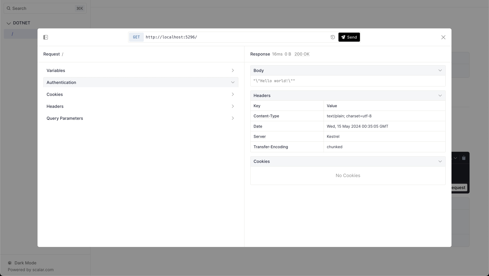

# Scalar .NET API Reference Integration

This .NET packages provides an easy way to render a beautiful API reference based on an OpenAPI/Swagger. Made possible by the wonderful work of [captainsafia](https://github.com/captainsafia) on [building the integration & docs written](https://learn.microsoft.com/en-us/aspnet/core/fundamentals/minimal-apis/aspnetcore-openapi?view=aspnetcore-9.0&tabs=visual-studio#using-scalar-for-interactive-api-documentation) for the Scalar & .NET integration.



## Installation

```bash
dotnet add package Scalar.AspNetCore
```

## Usage

Set up [Microsoft.AspNetCore.OpenApi](https://learn.microsoft.com/en-us/aspnet/core/fundamentals/minimal-apis/aspnetcore-openapi?view=aspnetcore-9.0&tabs=visual-studio)

```c#
using Scalar.AspNetCore;

var builder = WebApplication.CreateBuilder();

builder.Services.AddOpenApi();

var app = builder.Build();

app.MapOpenApi();

if (app.Environment.IsDevelopment())
{
    app.MapScalarApiReference();
}

app.MapGet("/", () => "Hello world!");

app.Run();
```

## Building & Release

```bash
dotnet build
dotnet pack --configuration Release
# then ping marc until we set up ci auto release!
```
