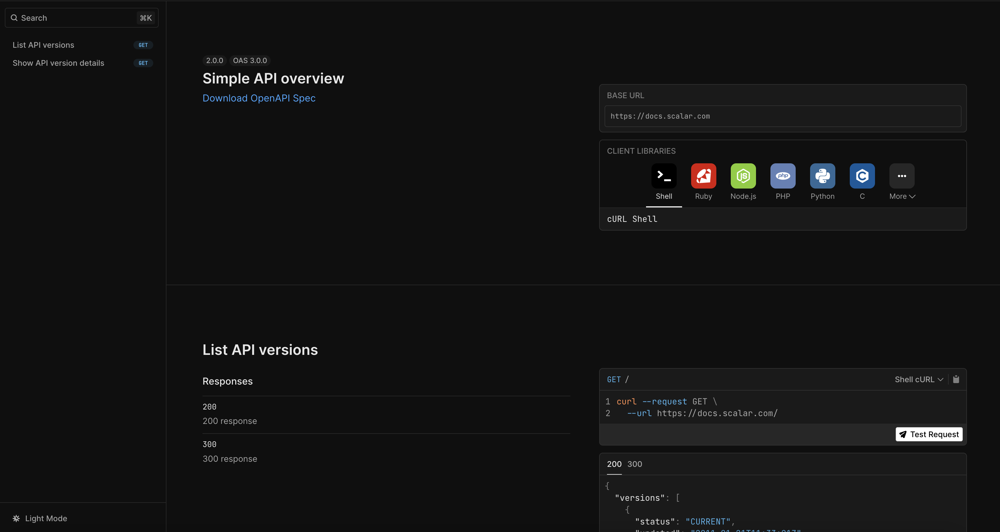

# Scalar Django Ninja API Reference Plugin



## Installation

```bash
pip install git+https://github.com/scalar/scalar.git#subdirectory=packages/scalar_django_ninja
```

## Usage

Integrating Scalar with Django Ninja is simple. Just pass the `ScalarViewer` instance to the `docs` parameter of the NinjaAPI instance.

```python
from ninja import NinjaAPI
from scalar_django_ninja import ScalarViewer

api = NinjaAPI(
    version="1.0.0",
    title="API Reference",
    description="API Reference for the Scalar Django Ninja Plugin",
    docs=ScalarViewer(),
    docs_url="/docs/",
)

@api.get("/add")
def add(request, a: int, b: int):
    return {"result": a + b}


urlpatterns = [
    path("admin/", admin.site.urls),
    path("api/", api.urls),
]

```

This render a beautiful API reference at `/api/docs` based your API.


