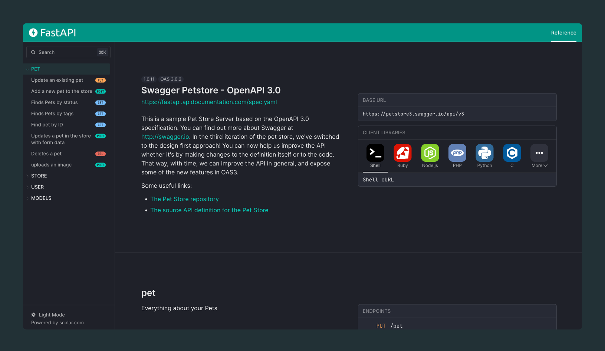

# Scalar FastAPI API Reference Plugin



## Installation

```bash
pip install scalar-fastapi
```

## Usage

FastAPI makes it super easy to enable scalar with their out of the box OpenAPI support

```python
from fastapi import FastAPI
from scalar_fastapi import get_scalar_api_reference

app = FastAPI()

@app.get("/")
def read_root():
    return {"Hello": "World"}

@app.get("/scalar", include_in_schema=False)
async def scalar_html():
    return get_scalar_api_reference(
        openapi_url=app.openapi_url,
    )

```
