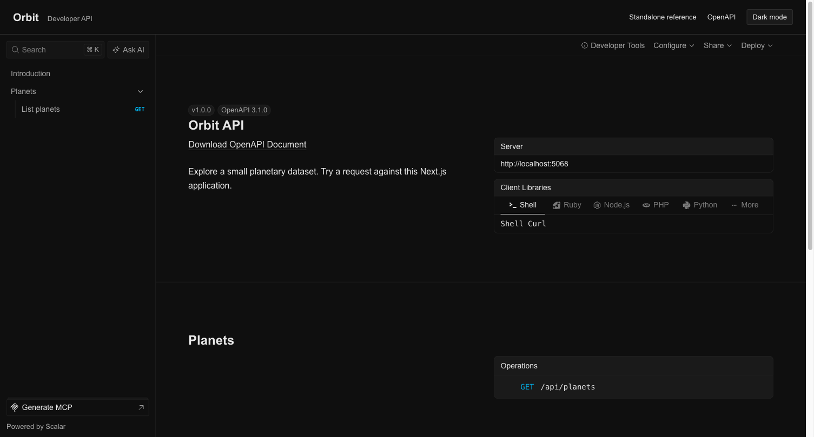

# Scalar + Next.js starter

A small working API with interactive documentation at `/scalar` and an embedded reference at `/embedded`. Uses Next.js 16, React 19, and published Scalar packages.

[](https://vercel.com/new/clone?repository-url=https%3A%2F%2Fgithub.com%2Fscalar%2Fscalar%2Ftree%2Fmain%2Ftemplates%2Fnextjs-api-reference&project-name=scalar-nextjs-starter&repository-name=scalar-nextjs-starter)

## Run locally

Copy this directory into a new project outside the Scalar repository. Use Node.js 22 or newer:

```bash
npm ci
npm run dev
```

Open <http://localhost:3000/scalar>. No account, environment variables, or monorepo build is required.

| URL             | What you can do                                                  |
| --------------- | ---------------------------------------------------------------- |
| `/scalar`       | Explore the standalone reference and send a test request         |
| `/embedded`     | View the reference in an application layout and toggle dark mode |
| `/openapi.json` | Read the API description                                         |
| `/api/planets`  | Get the sample planet catalog                                    |

The root redirects to `/scalar`. Both references use the local API, so test requests work on localhost and preview deployments.

## Customize

Change `app/api/planets/route.ts` and its description in `app/openapi.json/route.ts`. This starter writes the description explicitly; Scalar renders it. For generated descriptions, see the [Next.js integration guide](https://scalar.com/products/api-references/integrations/nextjs).

The standalone handler in `app/scalar/route.ts` has its own HTML document and a pinned CDN renderer. The embedded page inherits `app/layout.tsx`, exports page metadata, and shares its theme with the application header. Its font is configured in `app/embedded/style.css`.

The lockfile pins application dependencies. Update the standalone CDN version separately when upgrading its browser renderer.

## Check before deploying

```bash
npm run lint
npm run lint:unused
npm run build
npm run typecheck
npx playwright install chromium
npm test
```

The browser tests run the production build and send requests through both references.

## Deploy

Use the Vercel button above to copy this directory into its own repository, or import your copy into Vercel and select the Next.js framework preset. No environment variables are required. Keep this directory as the project root when importing the full Scalar repository.

For other Node.js hosting, run `npm run build` followed by `npm start`.

## Preview



